# Dhaka Tesla Pool

> Share a seat. Split the fare. Survive Dhaka traffic.

**Live app:** _pending deployment (see [Deployment](#19-deployment))_ · **API health:** _pending_ · **Demo video:** _pending_ · **Swagger:** `http://localhost:3001/docs` locally

> ⚠️ **Cold start:** once deployed, the API runs on Render's free tier and sleeps after 15 minutes idle. The first
> request can take up to ~60 s. Open `/health` first and wait for `{"status":"ok"}`; the web app shows a
> "Waking up the API" banner meanwhile.

## 1. Summary

Dhaka Tesla Pool is a ride-pooling MVP for Dhaka's battery "Teslas". A passenger requests a seat between predefined
zones; compatible trips from the same pickup zone share one vehicle without ever exceeding its seats; every passenger
sees only their own fare and status; and every ride keeps an append-only history that explains exactly what happened.
It is built for three actors from the brief: passengers (Nusrat, Rafiq, Shirin), a driver with a fixed-capacity Tesla
(Jashim and Bullet, 3 seats), and the pool that ties them together.

## 2. Problem

At 8:41 in Banani, Bullet has three seats and Jashim wants them full before he leaves. Nusrat (to Mohakhali) and
Rafiq (to Gulshan 1) want to pay less without negotiating with strangers. The system has to decide in about a second
whether their trips are compatible, guarantee that three seats never become four even when Shirin and someone else
grab the last one at the same instant, give each rider only their own fare and status, show Jashim who is riding and
what stage the trip is at, and keep enough history to answer "what happened?" later.

## 3. Features

**Passenger:** sign up / sign in; request a ride (pickup zone, destination zone, seats, cash or TeslaPay); live fare
preview ("Up to 57.36 BDT · 51.89 BDT if pooled"); status card that updates every 4 s (Waiting → Matched → Driver
arrived → In progress → Completed, or Cancelled); driver and vehicle name once matched, co-passengers only as a count;
cancel while valid (with confirmation); ride history and a per-ride timeline.

**Driver:** sign up with a vehicle and fixed seat count; go online/offline; pick the zone served; see waiting requests
there (first names only); accept one, which creates a pool and sweeps in compatible waiting requests; manifest with
seats "3 / 3 — Bullet is full", each member's fare and payment status, cash to collect; arrive → start → complete, or
cancel; after completing a trip the serving zone switches to where it ended (the last drop-off); pool history with
timeline.

**Pooling:** one matching rule applied by one function (`joinPool`) from both entry points (passenger request and
driver accept); seats enforced by a conditional UPDATE plus a database CHECK; fares lock for every member when the
trip starts; TeslaPay wallets settle at completion, falling back to "cash due" when short.

**Not in the MVP:** maps/GPS, real payments, ratings, cancellation fees, per-passenger dropoff order, wallet top-up
endpoint, refresh tokens, frontend unit tests (see [Known limitations](#24-known-limitations)).

## 4. Screenshots

Captured from the local `docker compose` stack.

| | |
|---|---|
| 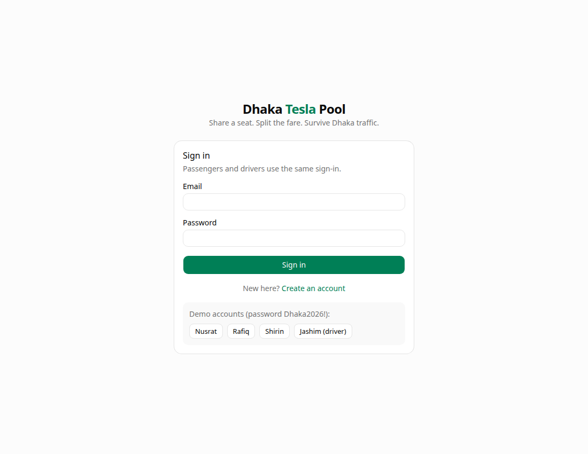 | 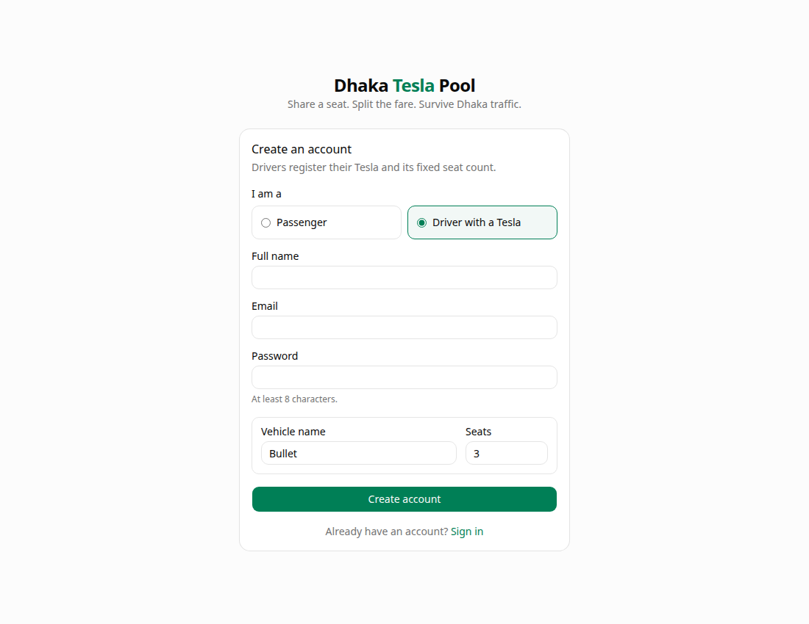 |
| Login with the seeded demo accounts | Driver registration: vehicle name and fixed seat count |
| 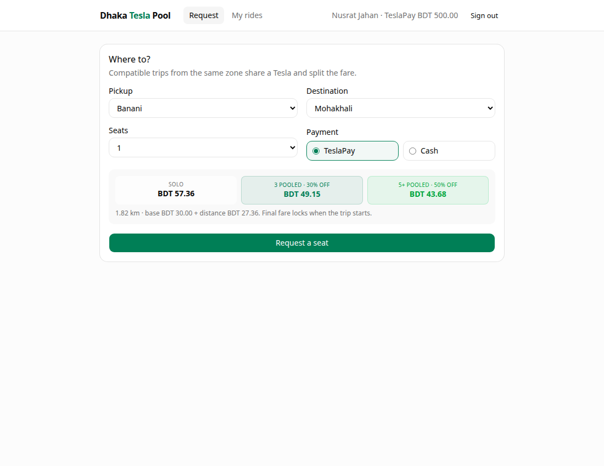 | 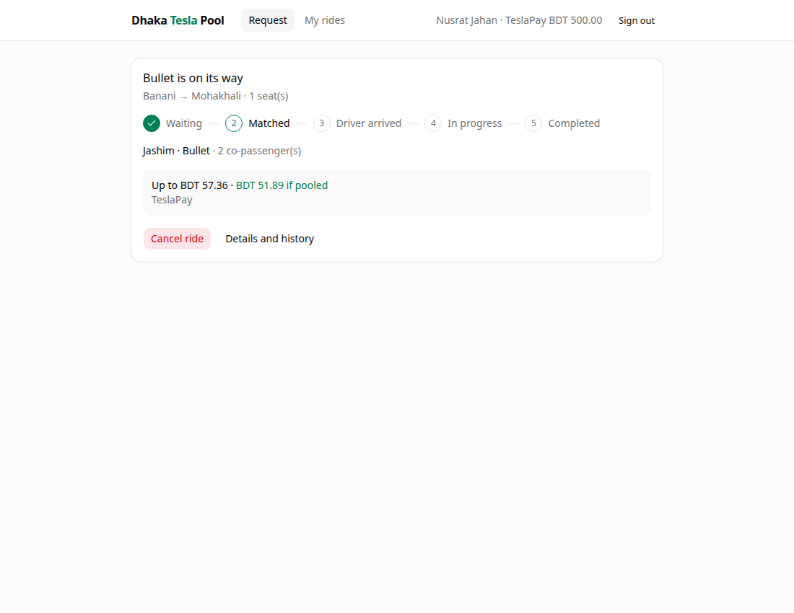 |
| Nusrat's request with the fare preview "Up to 57.36 · 51.89 if pooled" | Matched: "Jashim · Bullet · 2 co-passengers", no names |
| 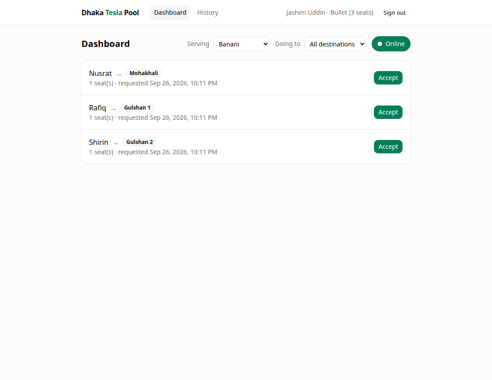 | 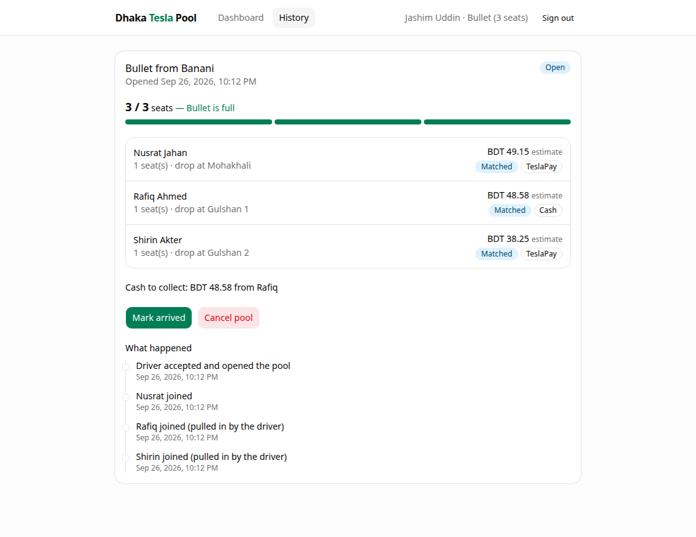 |
| Jashim online in Banani with three waiting requests | Manifest "3 / 3 — Bullet is full" with per-member fares |
| 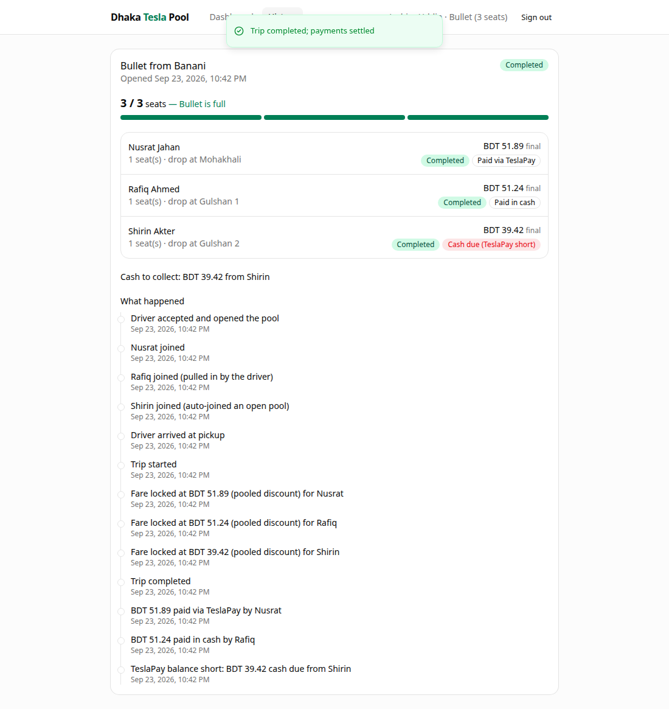 | 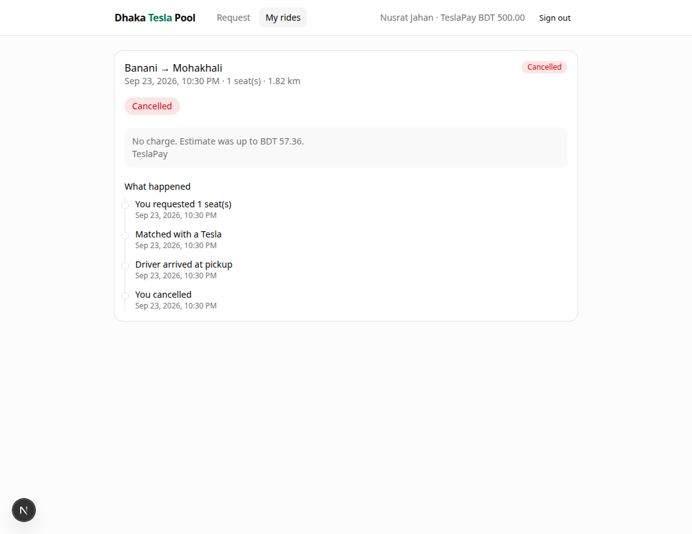 |
| After completion: Nusrat paid via TeslaPay, Rafiq cash, Shirin **cash due** | A cancelled ride's timeline, from `ride_events` |
| 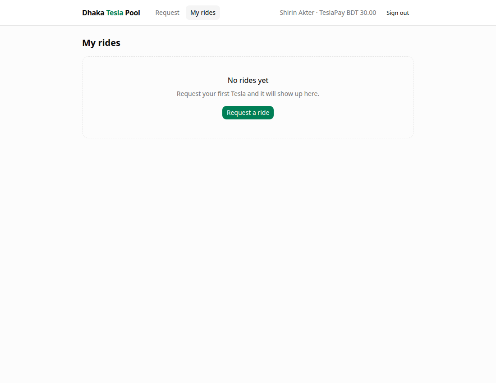 | 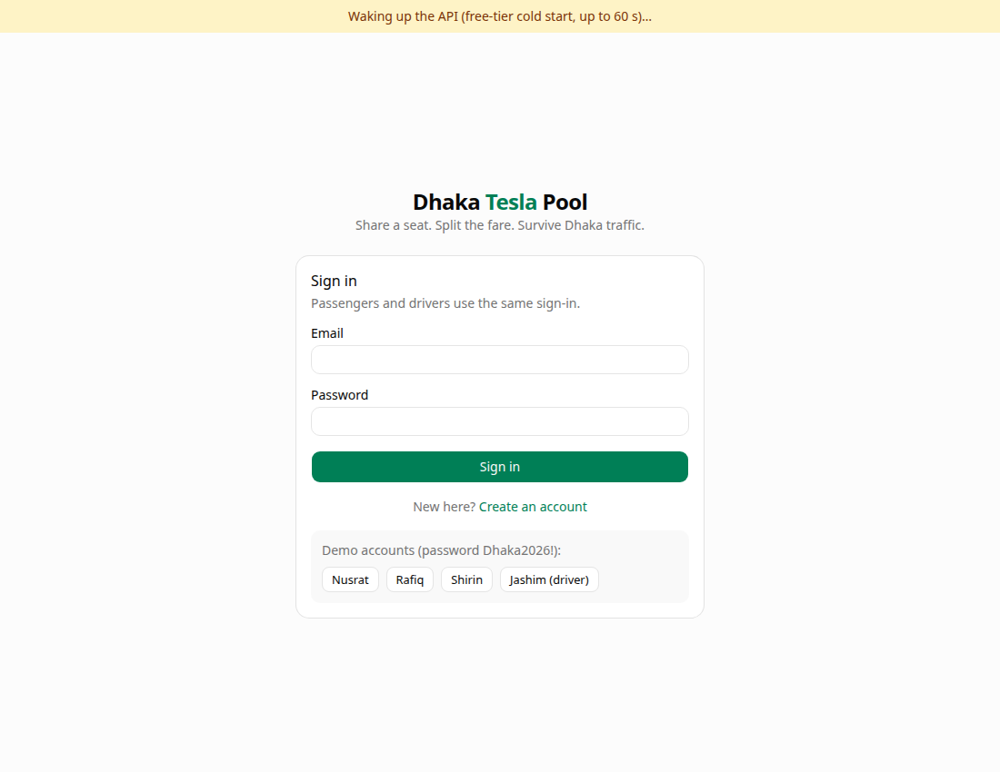 |
| Empty state with a call to action | Cold-start banner while the API is unreachable |

## 5. Architecture

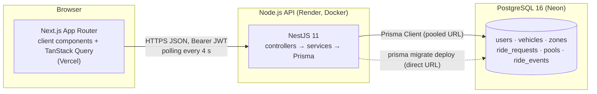
```mermaid
flowchart LR
    subgraph Client["Browser"]
        UI["Next.js App Router<br/>client components + TanStack Query<br/>(Vercel)"]
    end
    subgraph API["Node.js API (Render, Docker)"]
        N["NestJS 11<br/>controllers → services → Prisma"]
    end
    subgraph DB["PostgreSQL 16 (Neon)"]
        P[("users · vehicles · zones<br/>ride_requests · pools · ride_events")]
    end
    UI -- "HTTPS JSON, Bearer JWT<br/>polling every 4 s" --> N
    N -- "Prisma Client (pooled URL)" --> P
    N -. "prisma migrate deploy (direct URL)" .-> P
```

Browser → Next.js (client components + TanStack Query) → NestJS REST API → PostgreSQL. Locally the same three boxes
are the `web`, `api` and `db` containers. There is no Redis, queue or worker: a single PostgreSQL already serialises
the seat race (see [Concurrency](#22-concurrency)), and adding infrastructure without a reason is exactly what the brief
asks us not to do. Request flows (auto-join and accept + sweep) are in [docs/architecture.md](docs/architecture.md).

NestJS layering: controllers do HTTP shape only (DTO validation, guards); services own rules, transactions,
transitions, ownership checks and event recording; pure modules (`fare/fare.ts`, `pools/transitions.ts`,
`pools/matching.ts`) are deterministic and unit-tested; the database enforces the invariants that must survive a buggy
service; one exception filter maps everything to `{ code, message }`.

## 6. Data model

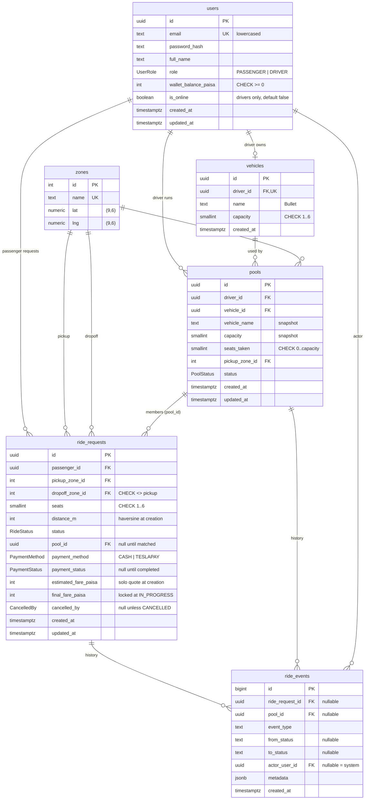
```mermaid
erDiagram
    users ||--o| vehicles : "driver owns"
    users ||--o{ ride_requests : "passenger requests"
    users ||--o{ pools : "driver runs"
    vehicles ||--o{ pools : "used by"
    zones ||--o{ ride_requests : "pickup"
    zones ||--o{ ride_requests : "dropoff"
    zones ||--o{ pools : "pickup"
    pools ||--o{ ride_requests : "members (pool_id)"
    ride_requests ||--o{ ride_events : "history"
    pools ||--o{ ride_events : "history"
    users ||--o{ ride_events : "actor"

    users {
        uuid id PK
        text email UK "lowercased"
        text password_hash
        text full_name
        UserRole role "PASSENGER | DRIVER"
        int wallet_balance_paisa "CHECK >= 0"
        boolean is_online "drivers only, default false"
        timestamptz created_at
        timestamptz updated_at
    }
    vehicles {
        uuid id PK
        uuid driver_id FK,UK
        text name "Bullet"
        smallint capacity "CHECK 1..6"
        timestamptz created_at
    }
    zones {
        int id PK
        text name UK
        numeric lat "(9,6)"
        numeric lng "(9,6)"
    }
    ride_requests {
        uuid id PK
        uuid passenger_id FK
        int pickup_zone_id FK
        int dropoff_zone_id FK "CHECK <> pickup"
        smallint seats "CHECK 1..6"
        int distance_m "haversine at creation"
        RideStatus status
        uuid pool_id FK "null until matched"
        PaymentMethod payment_method "CASH | TESLAPAY"
        PaymentStatus payment_status "null until completed"
        int estimated_fare_paisa "solo quote at creation"
        int final_fare_paisa "locked at IN_PROGRESS"
        CancelledBy cancelled_by "null unless CANCELLED"
        timestamptz created_at
        timestamptz updated_at
    }
    pools {
        uuid id PK
        uuid driver_id FK
        uuid vehicle_id FK
        text vehicle_name "snapshot"
        smallint capacity "snapshot"
        smallint seats_taken "CHECK 0..capacity"
        int pickup_zone_id FK
        PoolStatus status
        timestamptz created_at
        timestamptz updated_at
    }
    ride_events {
        bigint id PK
        uuid ride_request_id FK "nullable"
        uuid pool_id FK "nullable"
        text event_type
        text from_status "nullable"
        text to_status "nullable"
        uuid actor_user_id FK "nullable = system"
        jsonb metadata
        timestamptz created_at
    }
```

| Table | Why it exists |
|---|---|
| `users` | Both roles, one identity: `role`, bcrypt `password_hash`, TeslaPay `wallet_balance_paisa` (CHECK ≥ 0), driver `is_online` |
| `vehicles` | Bullet as an entity: `name`, fixed `capacity` (CHECK 1..6); one per driver (`driver_id` unique) |
| `zones` | The predefined Dhaka areas with `numeric(9,6)` lat/lng so hand calculations match exactly; never deleted (FK RESTRICT) |
| `ride_requests` | The passenger's side: seats, `distance_m` (stored at creation), status, `pool_id` (membership), payment, estimated and final fare |
| `pools` | One vehicle trip from one pickup zone: snapshot `capacity` and `vehicle_name`, the `seats_taken` counter, status |
| `ride_events` | Append-only audit trail for both entities: type, from/to status, actor (null = system), jsonb metadata |

Membership is the `pool_id` column, not a join table: a request is in at most one pool at a time, and "was in pool A,
driver cancelled, joined pool B" is in `ride_events`, whose rows carry both ids. Capacity is snapshotted on the pool
because `CHECK (seats_taken <= capacity)` can only see its own row. Full column-by-column notes:
[docs/erd.md](docs/erd.md).

## 7. Ride and pool lifecycle

Two lifecycles instead of one chain, because arrival, start and completion happen once per vehicle, not once per
passenger: one driver action, one transaction, N member rows updated consistently.

**Ride request (what Nusrat sees)**

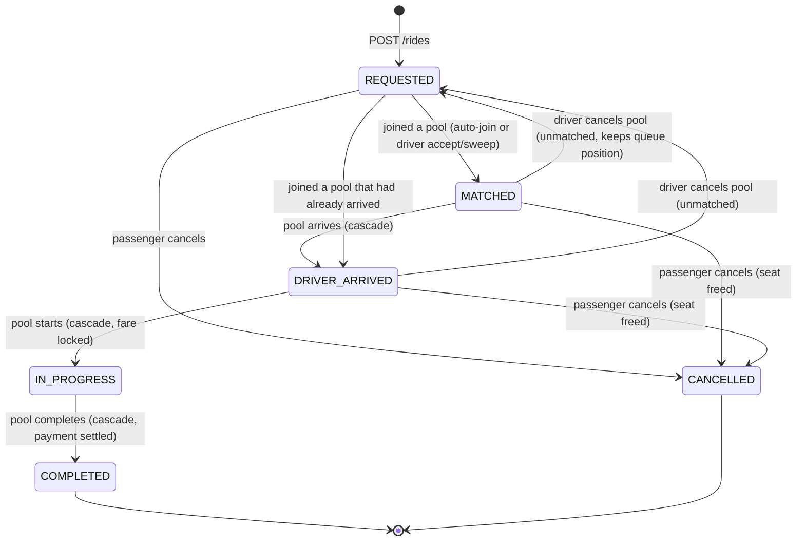
```mermaid
stateDiagram-v2
    [*] --> REQUESTED : POST /rides
    REQUESTED --> MATCHED : joined a pool (auto-join or driver accept/sweep)
    MATCHED --> DRIVER_ARRIVED : pool arrives (cascade)
    REQUESTED --> DRIVER_ARRIVED : joined a pool that had already arrived
    DRIVER_ARRIVED --> IN_PROGRESS : pool starts (cascade, fare locked)
    IN_PROGRESS --> COMPLETED : pool completes (cascade, payment settled)
    REQUESTED --> CANCELLED : passenger cancels
    MATCHED --> CANCELLED : passenger cancels (seat freed)
    DRIVER_ARRIVED --> CANCELLED : passenger cancels (seat freed)
    MATCHED --> REQUESTED : driver cancels pool (unmatched, keeps queue position)
    DRIVER_ARRIVED --> REQUESTED : driver cancels pool (unmatched)
    COMPLETED --> [*]
    CANCELLED --> [*]
```

**Pool (what Jashim sees)**

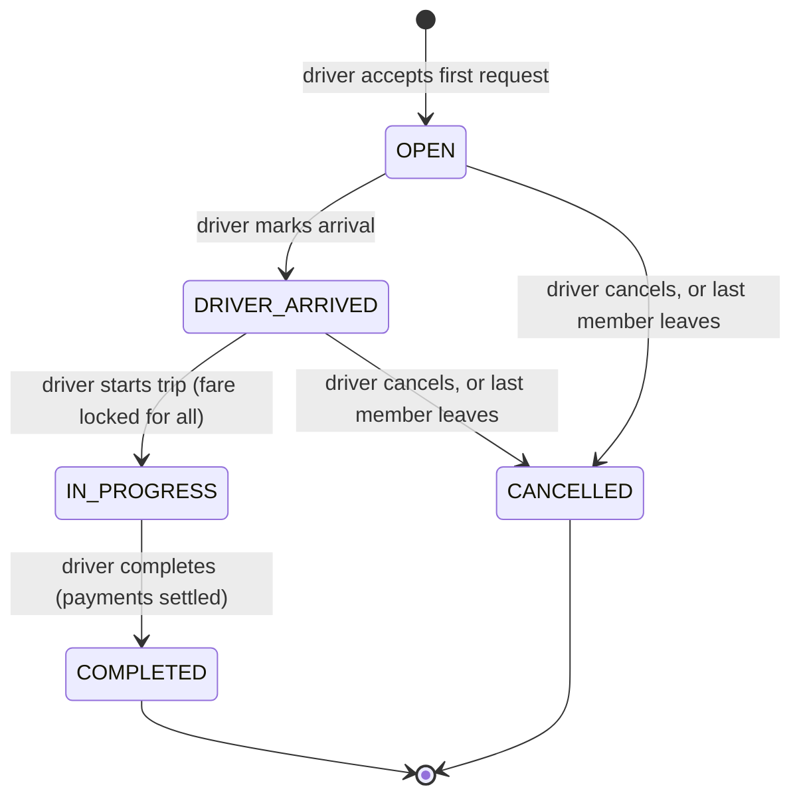
```mermaid
stateDiagram-v2
    [*] --> OPEN : driver accepts first request
    OPEN --> DRIVER_ARRIVED : driver marks arrival
    DRIVER_ARRIVED --> IN_PROGRESS : driver starts trip (fare locked for all)
    IN_PROGRESS --> COMPLETED : driver completes (payments settled)
    OPEN --> CANCELLED : driver cancels, or last member leaves
    DRIVER_ARRIVED --> CANCELLED : driver cancels, or last member leaves
    COMPLETED --> [*]
    CANCELLED --> [*]
```

| Change from the suggested chain | Why |
|---|---|
| `STARTED` → `IN_PROGRESS` | States are conditions, events are verbs: the event is `POOL_STARTED`, the state is `IN_PROGRESS` |
| Separate pool states | Arrive/start/complete are per vehicle; members cascade in the same transaction |
| Join allowed at `DRIVER_ARRIVED` | Shirin grabs the last seat while Jashim waits at the kerb; joining stops at `IN_PROGRESS` |
| Driver cancel reverts members to `REQUESTED` | They did nothing wrong and keep their queue position; logged as `RIDE_UNMATCHED` with the old pool id |
| Strict linear chain, no skipping | Simple transition table, exhaustive negative test; `start` from `OPEN` is a 409 |

The transition tables are data (`apps/api/src/pools/transitions.ts`) and every transition is a conditional update
(`UPDATE pools SET status = 'IN_PROGRESS' WHERE id = $1 AND status = 'DRIVER_ARRIVED'`); 0 rows →
`409 INVALID_TRANSITION` naming from and to. A double-clicked "Start" therefore succeeds once and fails safely once.

## 8. Matching rule

A request may join a pool when **all** hold:

1. Pool status is `OPEN` or `DRIVER_ARRIVED`.
2. Request pickup zone equals the pool's pickup zone.
3. `seats_taken + seats ≤ capacity`.
4. The haversine distance between the request's dropoff and **every** current member's dropoff is ≤ 3 000 m.
5. The request is `REQUESTED` with no pool.

| Dropoffs | Distance | Compatible |
|---|---|---|
| Mohakhali (Nusrat) ↔ Gulshan 1 (Rafiq) | 1 560 m | yes |
| Mohakhali ↔ Gulshan 2 (Shirin) | 2 056 m | yes |
| Gulshan 1 ↔ Gulshan 2 | 1 328 m | yes |
| Mohakhali ↔ Farmgate | 2 562 m | yes (borderline) |
| Mohakhali ↔ Uttara | 11 131 m | no |

One function, two triggers: `PoolsService.joinPool` is the only code that sets `pool_id` or increments `seats_taken`.
It runs when a passenger requests (auto-join into the fullest compatible open pool) and when a driver accepts (the
accepted request, then a sweep of waiting requests oldest-first). So whether Rafiq requests before or after Jashim
accepts Nusrat, the same rule puts them in the same pool. Known approximation: the rule ignores direction and roads.

## 9. Fare model

```
distance_m     = haversine(pickup zone, dropoff zone), whole metres, stored on the request
distanceCharge = round(distance_m × 1500 / 1000)          15 BDT per km
soloFare       = 3000 + distanceCharge                    30 BDT base
poolDiscount   = round(0.20 × distanceCharge)             only if ≥ 2 requests share the pool at start
passengerFare  = (soloFare − poolDiscount) × seats
```

| Trip | distance_m | distanceCharge | solo | discount | pooled |
|---|---|---|---|---|---|
| Nusrat: Banani → Mohakhali | 1 824 | 2 736 | **5 736** (57.36 BDT) | 547 | **5 189** (51.89 BDT) |
| Rafiq: Banani → Gulshan 1 | 1 770 | 2 655 | **5 655** (56.55 BDT) | 531 | **5 124** (51.24 BDT) |
| Shirin: Banani → Gulshan 2 | 785 | 1 178 | 4 178 (41.78 BDT) | 236 | 3 942 (39.42 BDT) |

Check Nusrat by hand: `1824 × 1500 / 1000 = 2736`; `3000 + 2736 = 5736`; `0.2 × 2736 = 547.2 → 547`;
`5736 − 547 = 5189`. The same line is a test in `apps/api/src/fare/fare.spec.ts`. Constants live in
`apps/api/src/fare/fare.constants.ts`.

- The estimate (`GET /fare/estimate`, `estimated_fare_paisa`) is the solo fare, labelled "up to".
- `final_fare_paisa` is written for every member in the transaction that moves the pool to `IN_PROGRESS`; membership
  is frozen from then on, so the number is stable and the passenger sees it during the ride.
- The discount counts requests, not seats; it is a flat 20 % for 2 or 3 members.
- **Money is integer paisa** (1 BDT = 100 paisa) end to end: exact arithmetic with no float rounding, trivial
  comparison, one unit across API, database and tests. `numeric` would also be exact, but Prisma returns `Decimal`
  objects that need a library at every boundary. The browser formats with `Intl.NumberFormat(locale, BDT)`.
- **Payment:** cash, or a simulated TeslaPay wallet debited at completion with
  `UPDATE users SET wallet = wallet − fare WHERE id = $1 AND wallet ≥ fare`; 0 rows → `PENDING`, cash due to the
  driver. Completion never blocks on payment. Shirin's 30.00 BDT wallet vs her 39.42 BDT fare shows it.

## 10. Tech stack

| Layer | Pick (exact version) |
|---|---|
| Web | Next.js 16.3.6 (App Router), React 19.2.8, TanStack Query 5.103.2, Tailwind CSS 4.3.3, shadcn/ui (base-ui), sonner 2.0.8 |
| API | NestJS 11.2.6, @nestjs/swagger 11.4.7, @nestjs/jwt 11.0.2, @nestjs/config 4.0.4, @nestjs/throttler 6.7.0, nestjs-pino 5.2.0, class-validator 0.15.1, helmet 8.3.0, bcryptjs 3.0.3 |
| Data | PostgreSQL 16, Prisma 6.19.3 |
| Tests | Jest 30.5.2, supertest, ts-jest, real PostgreSQL |
| Tooling | pnpm 10 workspaces, TypeScript 5.9.3, Docker Compose, Node 22 in images |

Justifications, alternatives and switch triggers: [Key decisions](#21-key-decisions-and-trade-offs).

## 11. Project structure

```
dhaka-tesla-pool/
├── apps/
│   ├── api/                         NestJS
│   │   ├── prisma/                  schema.prisma, migrations/ (hand-edited init migration)
│   │   ├── src/
│   │   │   ├── main.ts, app.setup.ts  helmet, CORS, ValidationPipe, filter, prefix (shared with tests)
│   │   │   ├── seed.ts              idempotent seed with the cast
│   │   │   ├── common/              DomainError + codes, exception filter, decorators, env validation
│   │   │   ├── prisma/  health/  auth/  zones/  fare/  events/
│   │   │   ├── rides/               passenger: create (+ auto-join), list, active, detail, cancel
│   │   │   └── pools/               driver: status, requests, accept + sweep, joinPool/leavePool, transitions
│   │   ├── test/                    e2e specs, cast fixtures, global setup
│   │   ├── Dockerfile  docker-entrypoint.sh
│   └── web/                         Next.js
│       ├── src/app/                 routes only: /, /login, /register, /passenger/**, /driver/**
│       ├── src/components/          AppShell, AsyncState, EmptyState, StatusBadge, StatusStepper, Timeline, ColdStartBanner, ui/
│       ├── src/features/            auth/, rides/, driver/ (components + api + queries + types)
│       ├── src/lib/                 api-client, query-client, format (Intl), status
│       └── Dockerfile
├── docker/init-test-db.sql          creates tesla_pool_test in the same container
├── docker-compose.yml  render.yaml  .env.example
└── docs/                            architecture.md, erd.md, scaling.md, screenshots/, plan-book/ (design, written first)
```

## 12. Prerequisites

Node 22+, pnpm 10 (`npm i -g pnpm@10`), Docker with Compose v2. Nothing else for `docker compose up`.

## 13. Environment variables

| Name | Used by | Example | Note |
|---|---|---|---|
| `POSTGRES_USER`, `POSTGRES_PASSWORD`, `POSTGRES_DB` | compose `db`, `api` | `tesla`, `tesla_local_only`, `tesla_pool` | local only |
| `JWT_SECRET` | api | `openssl rand -hex 32` | never commit a real one |
| `JWT_EXPIRES_IN` | api | `24h` | |
| `WEB_PORT` | compose | `3000` | host port for web; CORS follows it |
| `DATABASE_URL` | api | `postgresql://…/tesla_pool` | Neon **pooled** string in production |
| `DIRECT_URL` | api (migrate) | same locally | Neon **direct** string in production |
| `TEST_DATABASE_URL` | api e2e tests | `…/tesla_pool_test` | |
| `CORS_ORIGIN` | api | `http://localhost:3000` | comma-separated allow-list |
| `PORT` | api | `3001` | Render injects it |
| `NEXT_PUBLIC_API_URL` | web (build time) | `http://localhost:3001` | baked into the bundle; the browser calls it |

Three example files, one per runtime: [`.env.example`](.env.example) (compose),
[`apps/api/.env.example`](apps/api/.env.example) (API on the host), [`apps/web/.env.example`](apps/web/.env.example).
`.env` files are git-ignored; the API refuses to boot if a required variable is missing.

## 14. Run with Docker

```bash
git clone https://github.com/shahidulmiraj/dhaka-tesla-pool.git && cd dhaka-tesla-pool
cp .env.example .env          # set JWT_SECRET: openssl rand -hex 32
docker compose up --build     # db, api, web; wait for three "healthy"
```

Open <http://localhost:3000> and sign in as `nusrat@teslapool.demo` / `Dhaka2026!`.
Port 3000 taken? Set `WEB_PORT=3003` in `.env`; the API's CORS origin follows it.

On every boot the API container runs `prisma migrate deploy`, then the idempotent seed, then the server.
Reset everything with `docker compose down -v`.

```
$ docker compose ps
NAME                     STATUS
dhaka-tesla-pool-api-1   Up (healthy)
dhaka-tesla-pool-db-1    Up (healthy)
dhaka-tesla-pool-web-1   Up (healthy)
```

The web image is built with `NEXT_PUBLIC_API_URL=http://localhost:3001` because the browser runs on the host; only
server-to-server URLs use compose names (`db`). This was verified from a fresh clone: `cp .env.example .env` (with `WEB_PORT=3003`, as 3000 was taken on that
machine) and `docker compose up --build` to three healthy containers, the full Nusrat/Rafiq/Shirin story through the UI, then an
API restart with no duplicated seed rows.

## 15. Local development

```bash
pnpm install
docker compose up -d db
cp apps/api/.env.example apps/api/.env
cp apps/web/.env.example apps/web/.env.local
pnpm --filter api exec prisma migrate deploy
pnpm --filter api seed
pnpm --filter api start:dev      # http://localhost:3001, Swagger at /docs
pnpm --filter web dev            # http://localhost:3000
```

## 16. Migrations and seed

- The schema is `apps/api/prisma/schema.prisma`. The initial migration was generated by Prisma and then **hand-edited**
  to append what Prisma's schema language cannot express: the CHECK constraints (seats within capacity, wallet ≥ 0,
  `pool_id` iff matched, final fare iff started, distinct zones, event has a subject) and the partial unique indexes
  (one active request per passenger, one active pool per driver).
- New migrations: `pnpm --filter api exec prisma migrate dev --name <name>` (use `--create-only` to hand-edit first).
  Production and Docker: `prisma migrate deploy`, which replays the SQL verbatim.
- **Never run `prisma db push`**: it regenerates from the schema and drops the hand-written constraints.
- The seed (`apps/api/src/seed.ts`) runs on every container boot. It is upsert-only, keyed by email, zone name and
  fixed UUIDs, so a second boot changes nothing (tested in `test/history.e2e-spec.ts`). It creates the cast, the 12
  zones, Bullet and Rocket, and yesterday's completed Bullet trip for Nusrat and Rafiq so history is not empty.

## 17. Tests

```bash
docker compose up -d db          # tests use the tesla_pool_test database in the same container
pnpm --filter api test           # 84 unit tests: fare, transitions (every from/to pair), matching
pnpm --filter api test:e2e       # 59 e2e tests over HTTP against real PostgreSQL, --runInBand
```

| PRD behaviour | Test file | What it asserts |
|---|---|---|
| Bullet's capacity can never be exceeded | `test/capacity.e2e-spec.ts` | Nusrat, Rafiq, Shirin fill Bullet; a fourth waits; 2 seats never fit in 1; raw `UPDATE … seats_taken = 4` is rejected by the CHECK |
| Invalid state transitions are rejected | `test/transitions.e2e-spec.ts`, `src/pools/transitions.spec.ts` | start from OPEN, complete from DRIVER_ARRIVED, double arrive, cancel in progress → 409 with from/to; happy-path cascade |
| Nusrat's and Rafiq's pooled fares | `src/fare/fare.spec.ts`, `test/fare.e2e-spec.ts`, `test/fare-settlement.e2e-spec.ts` | 5736/5189 and 5655/5124; each sees only their own; solo pool gets no discount; wallet 50000 → 44811; Shirin PENDING |
| Users can't modify another user's ride | `test/ownership.e2e-spec.ts` | Rafiq → Nusrat's ride 403; Kamal → Jashim's pool 403; role guard; no token 401; smuggled `status` 400 |
| Cancellation rules hold | `test/cancellation.e2e-spec.ts` | seat freed on leave; last member leaving auto-cancels as SYSTEM; driver cancel reverts both to REQUESTED and Kamal sweeps them; no cancel after start |
| Two concurrent requests can't corrupt capacity | `test/capacity-race.e2e-spec.ts` | five racers for Bullet's last seat via `Promise.all`: all 201, exactly one joins, `seats_taken = 3`, four wait; two drivers sweeping one zone at once |

The race file was run 20 times in a row locally, green every time. It asserts on database state, not on 409s: losing
a seat race is not an error, the loser simply stays `REQUESTED`. Frontend components have no unit tests (the risky
logic is server-side); the UI was exercised end to end in headless Chrome against the compose stack.

## 18. Demo credentials

All synthetic. Password for every account: **`Dhaka2026!`**

| Person | Role | Email | Detail |
|---|---|---|---|
| Jashim Uddin | Driver | `jashim@teslapool.demo` | Bullet, 3 seats, serves Banani |
| Kamal Hossain | Driver | `kamal@teslapool.demo` | Rocket, 2 seats, offline by default |
| Nusrat Jahan | Passenger | `nusrat@teslapool.demo` | TeslaPay wallet 500.00 BDT; Banani → Mohakhali |
| Rafiq Ahmed | Passenger | `rafiq@teslapool.demo` | pays cash; Banani → Gulshan 1 |
| Shirin Akter | Passenger | `shirin@teslapool.demo` | TeslaPay wallet 30.00 BDT (too small: cash-due fallback); Banani → Gulshan 2 |

The login page has one-click buttons that fill these in.

## 19. Deployment

**Status: not deployed yet.** Everything needed is in the repo; the accounts (Neon, Render, Vercel, all free tier) have
to be created by the repository owner. Until then, `docker compose up` is the reproducible deployment.

1. **Neon** (Postgres): create project `dhaka-tesla-pool`, database `tesla_pool`. Copy the **pooled** connection
   string to `DATABASE_URL` and the **direct** one to `DIRECT_URL` (append `&connect_timeout=15` to both so the first
   query after Neon's autosuspend does not time out).
2. **Render** (API): New → Blueprint → this repo; [`render.yaml`](render.yaml) defines a free Docker web service from
   `apps/api/Dockerfile` with health check `/health`. Fill in `DATABASE_URL`, `DIRECT_URL`, and later `CORS_ORIGIN`.
   The container runs `migrate deploy` and the seed on boot. Do not set `PORT`; Render injects it.
3. **Vercel** (web): import the repo, Root Directory `apps/web`, env `NEXT_PUBLIC_API_URL=https://<api>.onrender.com`,
   production branch `pre-release` (then `release/v1.0.0`). Then set Render's `CORS_ORIGIN` to the Vercel URL and
   redeploy both (the API URL is baked into the web build).

Free-tier facts: Render sleeps after 15 minutes idle (~1 minute to wake; hence the banner); Neon autosuspends after 5
minutes (~1 s on the next query). Render's own free Postgres expires after 30 days, which is why the database is on
Neon.

## 20. API overview

REST + JSON, base path `/api/v1` (`/health` unprefixed), Bearer JWT, Swagger UI at `/docs`.

| Method | Path | Who | Notes |
|---|---|---|---|
| GET | `/health` | public | `{status, db, version}`; 503 if the database is down |
| GET | `/zones` | public | the 12 zones |
| GET | `/fare/estimate?pickupZoneId&dropoffZoneId&seats` | public | solo and pooled quote with breakdown |
| POST | `/auth/signup`, `/auth/login` | public | `{ token, user }`; drivers send `vehicle: { name, capacity }`; 10/min |
| GET | `/auth/me` | any | profile, wallet, vehicle (role re-read from the database) |
| POST | `/rides` | passenger | creates and tries to auto-join; `201` with `pool` or `null` |
| GET | `/rides`, `/rides/active`, `/rides/:id` | passenger | history, active (`204` if none), detail with own timeline |
| POST | `/rides/:id/cancel` | passenger | `REQUESTED` / `MATCHED` / `DRIVER_ARRIVED` only |
| PATCH | `/driver/status` | driver | `{ online }` |
| GET | `/driver/requests?pickupZoneId` | driver | waiting requests in a zone, oldest first |
| POST | `/driver/pools` | driver | `{ requestId }`: create pool + sweep |
| GET | `/driver/pools`, `/driver/pools/active`, `/driver/pools/:id` | driver | history, active, manifest with events |
| POST | `/driver/pools/:id/arrive` · `start` · `complete` · `cancel` | driver | state machine commands |

Every error is `{ "code": "INVALID_TRANSITION", "message": "Pool cannot move from OPEN to IN_PROGRESS" }` (plus
`details` for validation). Codes: `VALIDATION_ERROR`, `SAME_ZONE`, `UNAUTHENTICATED`, `INVALID_CREDENTIALS`,
`FORBIDDEN`, `NOT_FOUND`, `EMAIL_TAKEN`, `ACTIVE_RIDE_EXISTS`, `INVALID_TRANSITION`, `NO_VEHICLE`, `DRIVER_OFFLINE`,
`DRIVER_HAS_ACTIVE_POOL`, `ACTIVE_POOL_EXISTS`, `REQUEST_NOT_AVAILABLE`, `SEATS_EXCEED_CAPACITY`, `RATE_LIMITED`,
`INTERNAL`. Someone else's ride or pool is `403`, not `404`: ids are unguessable UUIDs and ownership is checked before
any state is revealed.

**Why REST and not GraphQL:** six resources and a handful of commands (`arrive`, `start`, `complete`, `cancel`) map
onto `POST` sub-resources that read like the state machine; there is one client with fixed views, so field selection
buys nothing; every path is curl-able; Swagger comes free from the same DTO decorators used for validation. GraphQL
would add a schema layer, resolver-level authorisation and N+1 handling for members and events. Switch trigger: a
second client (mobile, partners) with materially different data needs.

## 21. Key decisions and trade-offs

| Decision | Alternatives | Why here | Switch trigger |
|---|---|---|---|
| **NestJS 11** | Express, Fastify, Hono | Modules, DI, DTO validation, guards, exception filters and Swagger map directly onto the rubric (validation, auth, logic placement, errors) and onto ASP.NET Core habits | API shrinks to 2–3 endpoints (Fastify) or goes serverless (Hono) |
| **Prisma 6, not 7** | Drizzle, TypeORM, Kysely, raw `pg` | Typed client, plain-SQL migrations that can be hand-edited for CHECKs and partial indexes, `directUrl` for Neon. Prisma 7 needs ESM, a config file and driver adapters, and drops `directUrl`; NestJS emits CommonJS | Heavy SQL (CTEs, PostGIS) everywhere → Kysely/Drizzle |
| **PostgreSQL 16** | MySQL, SQLite, MongoDB | Capacity is a relational-integrity problem: CHECKs, partial unique indexes, row locks, `timestamptz`, `jsonb` for events; SQLite cannot show concurrent writers | None at this scale; shard by city later |
| **Conditional UPDATE + CHECK for seats** | `SELECT … FOR UPDATE`, advisory locks, `SERIALIZABLE`, Redis lock | One statement is both the check and the claim; Postgres row-locks and re-evaluates the WHERE for the waiter; the CHECK is a second, independent layer | Thousands of joins/s on one pool → matcher ownership (see scaling) |
| **REST + OpenAPI** | GraphQL, tRPC | See §20 | Second client with different needs |
| **class-validator, whitelist + forbidNonWhitelisted** | zod, Joi | Nest-native; unknown fields such as `status` or `finalFarePaisa` are rejected with 400 | A shared web/API package → zod |
| **JWT Bearer in localStorage** | httpOnly cookie, sessions, Auth.js, Clerk | Web and API are on different origins (Vercel/Render); a Bearer token needs only a CORS allow-list, no cross-site cookie, CSRF or Safari ITP issues. Trade-off: readable by injected scripts, mitigated by no `dangerouslySetInnerHTML`, strict validation, 24 h expiry | Same-origin deployment → httpOnly `SameSite=Lax` cookie; revocation → refresh tokens |
| **Client-side `RequireRole`, no Next middleware** | middleware/`proxy.ts` | Middleware cannot read a localStorage token; role comes from `/auth/me`, never decoded in the browser | Cookie-based auth |
| **Polling every 4 s** | SSE, WebSockets | One free-tier instance that sleeps, no socket server on Vercel; TanStack Query does it in one option and stops on terminal states; ≤ 4 s is fine for "driver arrived" | Hundreds of concurrent open rides or sub-second needs → SSE first |
| **TanStack Query** | SWR, fetch-in-effect, RTK Query | Polling, invalidation after mutations, `isPending`/`isError` map onto loading/error/empty; no optimistic updates because the server owns the state machines | Real-time channel (keep Query for cache) |
| **Tailwind + shadcn/ui, native `<select>`** | MUI, Chakra, CSS modules | Components live in the repo; native selects and radios are accessible with zero code | A mandated design system |
| **Zones table, no maps** | Maps API, PostGIS | The brief asks not to fight maps; 12 seeded centre points make fares and matching hand-checkable | Real pickup coordinates → PostGIS `ST_DWithin` |
| **Driver cancel reverts members to `REQUESTED`** | cancel them | Passengers did nothing wrong and keep their place | Product decides otherwise |
| **Fare lock at start** | lock at completion | Same number, but visible during the ride; membership is frozen from `IN_PROGRESS` | Dynamic in-trip pricing |
| **Jest + supertest against real Postgres** | Vitest, Testcontainers, mocked Prisma | The capacity and race tests are meaningless against a mock | CI without Docker → Testcontainers or a Neon branch |
| **nestjs-pino** | Nest Logger, winston | One JSON line per request with request id, status, duration and `userId`; authorization header redacted | Ship to a log aggregator at scale |
| **helmet, CORS allow-list, throttler (100/min, 10/min on auth), bcrypt cost 10** | an API gateway | One line each; basic security the brief names | Behind a real gateway these move to the edge |
| **pnpm workspace, no shared package** | two repos, Turborepo/Nx | One history to inspect; two apps need no task graph; types duplicated from Swagger | A third consumer or ~20 shared types |
| **Vercel + Render (Docker) + Neon** | Koyeb, Fly.io, Railway, Render Postgres, Supabase | Durable free tiers; Render runs the same Dockerfile as compose; Neon gives pooled and direct URLs | Paying customers → one paid always-on provider |

**Where the implementation deviates from the design notes in `docs/plan-book`, and why:**

1. **The sweep uses `FOR UPDATE SKIP LOCKED`, one candidate at a time.** The design said "no FOR UPDATE anywhere".
   Seat allocation still is only the conditional UPDATE, but two drivers accepting and sweeping the same zone could
   deadlock on each other's request rows. SKIP LOCKED makes each sweep skip rows the other is joining. Locking all
   candidates up front made the second sweep skip rows the first would never take (Rocket stayed half empty; the
   two-driver race test caught it), so the sweep locks one fitting candidate at a time.
2. **`joinPool` re-checks the destination rule while holding the pool row lock** and, if the rule or the request
   update fails, gives the seats back inside the same transaction instead of aborting it. Otherwise two passengers
   whose destinations are compatible with the members but not with each other could join at the same instant, and
   one stolen sweep candidate would roll back a driver's whole accept.
3. **Driver online/offline is logged, not stored in `ride_events`**: the table's `CHECK (ride_request_id IS NOT NULL
   OR pool_id IS NOT NULL)` says every audit row is about a ride or a pool, and availability is neither.
4. **A passenger's timeline shows pool events only while they were a member** (from `RIDE_MATCHED` to
   `RIDE_UNMATCHED`/`RIDE_CANCELLED`), so it never shows a pool's history from before they joined or after they left.
5. **The optional wallet top-up endpoint was skipped**: seed balances cover the demo.
6. **`WEB_PORT`** was added to compose because port 3000 was taken on the development machine; CORS follows it.

## 22. Concurrency

**The problem:** Bullet has one seat left. Nusrat and Shirin submit at the same instant and both read "1 seat free".

**What we do now:** every seat claim is one conditional UPDATE inside the request's transaction:

```ts
await tx.pool.updateMany({
  where: { id: pool.id, status: { in: ['OPEN', 'DRIVER_ARRIVED'] }, seatsTaken: { lte: pool.capacity - request.seats } },
  data: { seatsTaken: { increment: request.seats } },
});   // count 0 → full or no longer joinable → try the next pool or stay REQUESTED
```

1. PostgreSQL takes a **row lock** on the `pools` row for the first UPDATE; the second transaction's UPDATE waits on it.
2. When the first commits, the second **re-evaluates its WHERE** against the new row version (READ COMMITTED
   behaviour for UPDATE): `seats_taken` is now 3, `3 ≤ 3 − 1` is false, so **zero rows** are updated.
3. The loser gets `201` with `pool: null` and waits as `REQUESTED` for another Tesla. Nobody saw a stale count win.
4. If the service were ever wrong, **`CHECK (seats_taken <= capacity)`** rejects the write in the database.

Every path that touches a pool and its members locks the pool row first, then member rows, so transactions cannot
wait on each other in a cycle; the driver sweep additionally uses `SKIP LOCKED` (above). Conditional updates also give
idempotency: a double-clicked "Start" produces one transition and one 409, and a double-submitted `POST /rides` hits
the partial unique index (`23505`) and becomes `409 ACTIVE_RIDE_EXISTS`. Proven by `test/capacity-race.e2e-spec.ts`
against real PostgreSQL.

**At larger scale:** many API instances change nothing (the database serialises, the API is stateless). Thousands of
joins per second on one hot pool turn row-lock waits into latency: move matching into per-region workers that own
their pools (ownership instead of locks), or add an optimistic `version` column with retry. Regional databases only
need cross-store coordination if a pool could span regions, which sharding by city avoids. Status polling moves to
read replicas or a cache first, and to SSE. Details: [docs/scaling.md](docs/scaling.md).

## 23. Assumptions

1. A driver serves one pickup zone at a time and selects it on the dashboard; drivers have no GPS position.
2. Destination compatibility is "within 3 km of every existing member's destination", direction-agnostic.
3. Fare constants: 30 BDT base, 15 BDT/km, 20 % pool discount on the distance charge when at least two requests share
   the vehicle at start.
4. Fares lock when the trip starts; membership is frozen from that point.
5. Passengers and drivers may cancel until the trip starts; cancelling a pool returns its passengers to the queue.
6. TeslaPay is a prepaid wallet; an insufficient balance falls back to cash due and never blocks completion.
7. Zone coordinates are approximate centre points chosen for the demo.
8. One vehicle per driver, one active request per passenger, one active pool per driver.
9. No ratings, cancellation fees or per-passenger dropoff ordering in the MVP.
10. When a trip completes, the driver is where the last passenger got off. With no drop-off order in the MVP, the last
    stop is the drop-off farthest from the pickup (`endZone` on the pool), and the driver's serving zone switches to it
    (they can change it back).
11. A request asking for more seats than any vehicle has waits forever; a driver accepting it gets
    `409 SEATS_EXCEED_CAPACITY`.

## 24. Known limitations

- Matching ignores direction and road geometry (a dropoff 2 km "behind" the pickup passes).
- No GPS: zones only; one pickup zone per driver at a time.
- Payments are simulated; no top-up endpoint; no refunds.
- JWT in `localStorage` (XSS-readable) with a 24 h expiry and no revocation.
- Status updates are polled (up to 4 s delay).
- No frontend unit tests.
- Free-tier cold start of up to ~60 s once deployed.
- The API image is ~720 MB (Prisma engines and full production dependencies); not optimised.

## 25. Next improvements

Server-Sent Events for status; tiered pool discount (2 vs 3 members); per-passenger dropoff order and ETA; ratings;
refresh tokens and httpOnly cookies behind one origin; cancellation fee after `DRIVER_ARRIVED`; wallet top-up and a
`payments` table once refunds exist; route-corridor matching with PostGIS; a slimmer API image.

## 26. If Oi Tesla goes viral

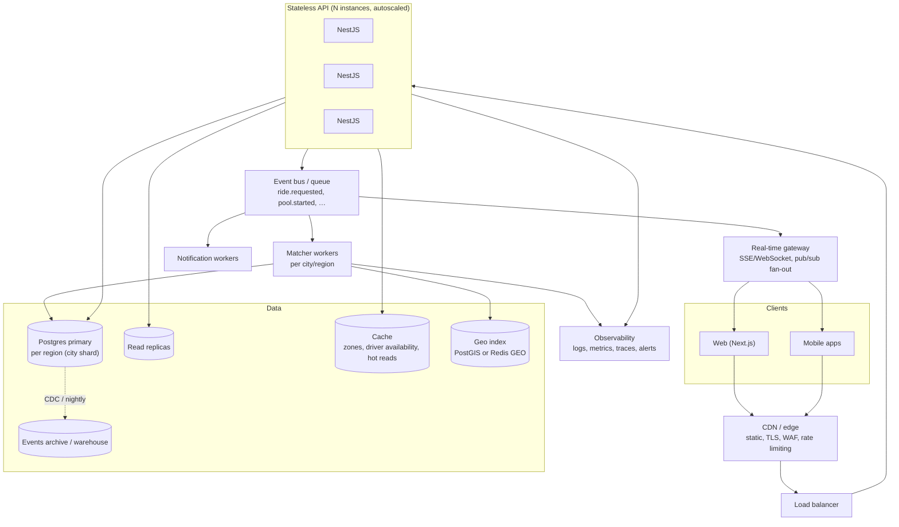
```mermaid
flowchart TB
    subgraph Clients
        W["Web (Next.js)"]
        M["Mobile apps"]
    end
    CDN["CDN / edge<br/>static, TLS, WAF, rate limiting"]
    LB["Load balancer"]
    subgraph API["Stateless API (N instances, autoscaled)"]
        A1["NestJS"]
        A2["NestJS"]
        A3["NestJS"]
    end
    RT["Real-time gateway<br/>SSE/WebSocket, pub/sub fan-out"]
    Q["Event bus / queue<br/>ride.requested, pool.started, …"]
    MATCH["Matcher workers<br/>per city/region"]
    NOTIF["Notification workers"]
    subgraph Data
        PG_W[("Postgres primary<br/>per region (city shard)")]
        PG_R[("Read replicas")]
        CACHE[("Cache<br/>zones, driver availability, hot reads")]
        GEO[("Geo index<br/>PostGIS or Redis GEO")]
        OLAP[("Events archive / warehouse")]
    end
    OBS["Observability<br/>logs, metrics, traces, alerts"]

    W --> CDN --> LB --> API
    M --> CDN
    API --> PG_W
    API --> PG_R
    API --> CACHE
    API --> Q
    Q --> MATCH --> PG_W
    Q --> NOTIF
    Q --> RT --> W
    RT --> M
    MATCH --> GEO
    PG_W -. "CDC / nightly" .-> OLAP
    API --> OBS
    MATCH --> OBS
```

Keep Postgres as the system of record with the same constraints (shard by city so every pool lives in one database and
the conditional-UPDATE story still holds), keep one matching function (where it runs changes, what it decides does
not), keep `ride_events` (partition and archive, never drop). The full reasoning (what breaks first, load balancing,
replicas, caching, geospatial search, events, real-time, rate limiting, idempotency, observability, contention,
retries, security, deployment) is in [docs/scaling.md](docs/scaling.md).

## 27. AI usage

**Tools:** Claude Code (Anthropic, Claude Opus 5.5) and the official docs of NestJS, Prisma, Next.js, Render, Neon and
Vercel.

**What for:** the design in [`docs/plan-book/`](docs/plan-book) (stack, schema, state machines, matching rule, fare
model, API, tests, git plan) was written before any code. Claude Code then implemented the whole repository from that
design in one guided session: NestJS modules and DTOs, the migration with hand-added constraints, the seed, e2e tests
from the rule tables, the Next.js screens, the Dockerfiles and compose, and this README. It worked branch by branch,
running the tests and a headless-Chrome walk-through of the story before each merge. Every AI-drafted commit carries a
`Co-Authored-By: Claude` trailer.

**Accepted suggestion:** re-checking the destination rule inside `joinPool` *after* the conditional seat UPDATE has
taken the pool row lock, and giving the seats back in the same transaction if the rule or the request update fails.
The design only checked compatibility before the UPDATE, which leaves a window where two mutually incompatible
passengers join together. Accepted because it closes that window without any extra lock.

**Rejected / changed suggestion:** the first version of the driver sweep locked *all* candidate requests up front
with `FOR UPDATE SKIP LOCKED`. The two-driver race test showed Rocket stuck at 1 of 2 seats while requests waited,
because Jashim's sweep held rows it would never take. Changed to locking one fitting candidate at a time (commit
`fix(pools): lock sweep candidates one at a time so concurrent sweeps fill both pools`).

**Also rejected:** the latest `@nestjs/config` 12 and `@nestjs/jwt` 12 that the package manager picked by default
(ESM-only; they break the CommonJS build and Jest), pinned to 4.x and 11.x; Prisma 7 (ESM, driver adapters, no
`directUrl`); the generated base-ui `Select` (shows raw ids unless given an item map), replaced with native `<select>`;
Next.js middleware for route protection (cannot read a localStorage token).

## 28. Demo video

_Pending: to be recorded (OBS, ≤ 6 minutes) and linked here and at the top._
Planned chapters: 0:00 problem and users · 1:00 architecture, database, lifecycle, key decision (conditional UPDATE),
trade-off (polling) · 3:00 passenger flow · 4:00 driver flow and pooling · 5:00 edge case (Shirin's short wallet,
fourth passenger waits) · 5:40 deployment and git history.
