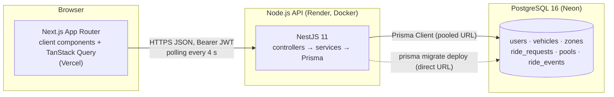
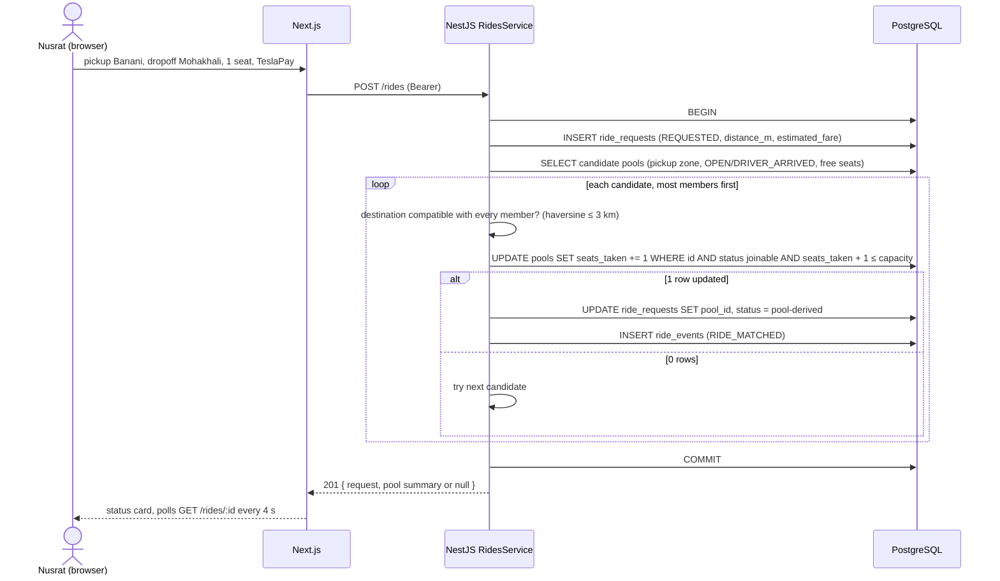
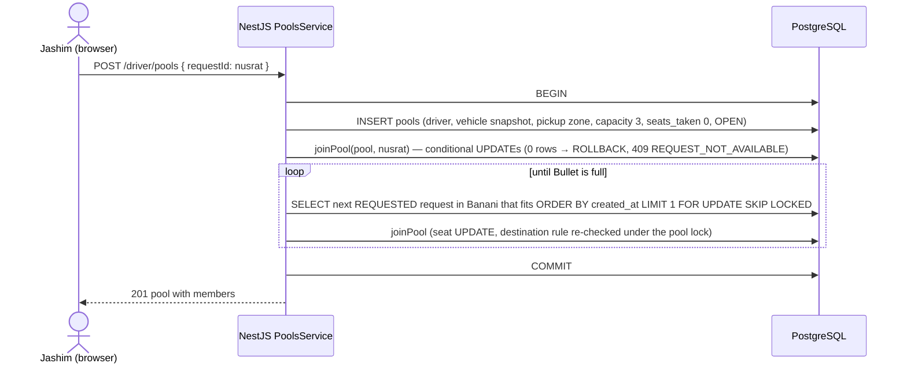

# Architecture

## System view



Locally the same three boxes run as `web`, `api`, and `db` containers from `docker compose up`. Nothing else: no Redis, no queue, no worker. The PRD forbids adding those for show, and the design does not need them (see the README's Concurrency section for why Postgres alone serialises the seat race).

## Request flows

### Nusrat requests a ride and gets auto-pooled with Rafiq



### Jashim accepts Nusrat, sweep pulls in Rafiq



Both entry points call the same `joinPool` function. That is the "apply the matching rule consistently" requirement made structural.

### Pool transitions cascade

`POST /driver/pools/:id/start`: one transaction updates the pool `WHERE status = 'DRIVER_ARRIVED'`, then updates every member request to `IN_PROGRESS`, writes each member's `final_fare_paisa`, inserts one `ride_events` row per entity. If the pool UPDATE touches 0 rows the service throws `409 INVALID_TRANSITION` and nothing else runs.

## Monorepo layout

```
dhaka-tesla-pool/
├── apps/
│   ├── api/                      NestJS
│   │   ├── prisma/
│   │   │   ├── schema.prisma
│   │   │   └── migrations/
│   │   ├── src/
│   │   │   ├── main.ts           helmet, cors, pipes, swagger, pino, listen 0.0.0.0
│   │   │   ├── app.module.ts
│   │   │   ├── seed.ts           idempotent upserts (compiled by nest build)
│   │   │   ├── common/           exception filter, error codes, decorators, guards
│   │   │   ├── prisma/           PrismaModule, PrismaService
│   │   │   ├── health/
│   │   │   ├── auth/             signup, login, me, JwtStrategy, RolesGuard
│   │   │   ├── zones/            GET /zones, fare estimate endpoint, trip validation
│   │   │   ├── fare/             pure functions: haversine, quote, finalFare
│   │   │   ├── rides/            passenger side: create (with auto-join), list, detail, cancel
│   │   │   ├── pools/            driver side: status, requests, accept+sweep, transitions, joinPool/leavePool, transition tables
│   │   │   └── events/           EventsService.record(tx, ...) helper only; no controller
│   │   ├── test/                 e2e specs, globalSetup (migrate + truncate)
│   │   ├── Dockerfile
│   │   └── docker-entrypoint.sh
│   └── web/                      Next.js
│       ├── src/app/              routes only
│       ├── src/components/       AppShell, AsyncState, EmptyState, StatusBadge, StatusStepper, Timeline, ColdStartBanner, ui/ (shadcn)
│       ├── src/features/         auth/, rides/, driver/ (components + api + queries per feature)
│       ├── src/lib/              api-client.ts, query-client.ts, format.ts
│       └── Dockerfile
├── docker/init-test-db.sql
├── docker-compose.yml
├── .env.example
├── docs/                         architecture.md, erd.md, scaling.md, plan-book/ (design written before code)
├── pnpm-workspace.yaml
└── README.md
```

No `packages/shared`. Types are duplicated in `apps/web/src/features/*/types.ts` from the Swagger output. Adding a shared package would complicate both Dockerfiles (pnpm inject/deploy) for a handful of interfaces. Switch trigger: a third consumer or more than ~20 shared types.

## NestJS layering rules

| Layer | Responsibility | Never does |
|---|---|---|
| Controller | HTTP shape: DTO validation, auth decorators, map service result to response | Business rules, Prisma calls |
| Service | Business rules, transactions, transitions, ownership checks, event recording | HTTP status codes (throws domain exceptions carrying an error `code`) |
| Pure modules (`fare/fare.ts`, `pools/transitions.ts`, `pools/matching.ts`) | Deterministic functions with unit tests | I/O |
| PrismaService | Connection, `$transaction`, shutdown hook | Logic |
| Exception filter | Maps domain exceptions and Prisma errors (P2002 → 409, P2025 → 404) to `{ code, message }` | — |

This mirrors Clean Architecture without the extra projects: the interview answer is "controllers are thin, rules live in services and pure modules, the database enforces invariants that must survive a buggy service".

## Cross-cutting

- **Error contract:** every error body is `{ "code": "INVALID_TRANSITION", "message": "Pool cannot move from OPEN to IN_PROGRESS" }` with the matching HTTP status. Tests assert on `code`; the UI shows `message`.
- **Time:** stored as `timestamptz`, DB `now()` defaults, emitted as ISO 8601 UTC, formatted in the browser with `Intl.DateTimeFormat(navigator.language, { timeZone: 'Asia/Dhaka' })`.
- **Money:** integer paisa in the API; formatted in the browser with `Intl.NumberFormat(locale, { style: 'currency', currency: 'BDT' })` from `paisa / 100`.
- **Ids:** UUID v4 for users, requests, pools; serial for zones; bigserial for events.
- **Logging:** one JSON line per request (id, method, path, status, ms, userId if authenticated). Domain events also go to `ride_events`, which is the audit trail the PRD asks for.
- **Config:** `@nestjs/config` reading `DATABASE_URL`, `DIRECT_URL`, `JWT_SECRET`, `JWT_EXPIRES_IN`, `CORS_ORIGIN`, `PORT`. Fail fast at boot if any is missing.
