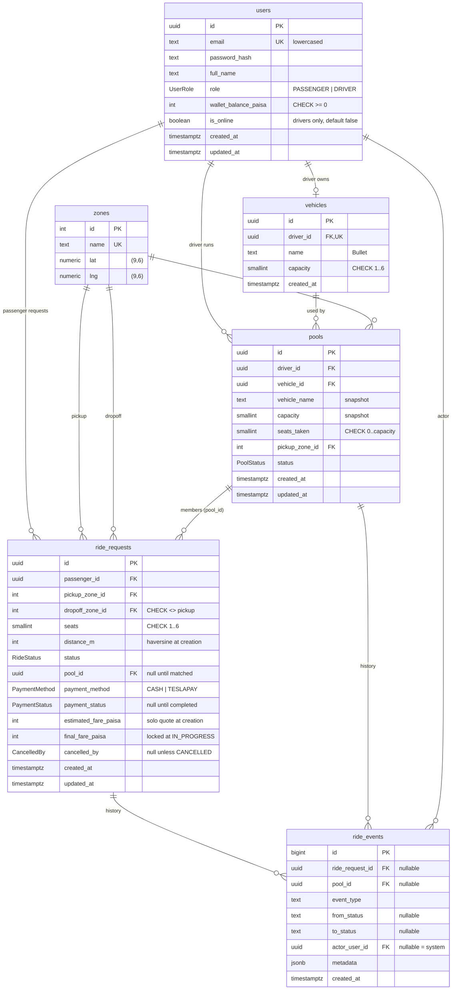

# 03 — Database Design

Six tables. Every one of them answers a sentence in the PRD. Be able to explain each column.

## ERD



## Tables, one by one

### `users`
One table for both roles. A `role` column, not two tables: the PRD's actors share identity, login, and audit needs. Driver-only columns (`is_online`) are nullable-in-meaning but default `false` for simplicity.

| Column | Type | Why |
|---|---|---|
| `id` | uuid | Not enumerable; safe in URLs |
| `email` | text, unique | Login key. Service lowercases and trims before insert; the unique index then catches duplicates regardless of case |
| `password_hash` | text | bcrypt, cost 10 |
| `full_name` | text | "Nusrat", "Jashim"; shown to the other party |
| `role` | enum `PASSENGER`/`DRIVER` | Guards read it from the JWT and re-verify on `/auth/me` |
| `wallet_balance_paisa` | int, CHECK ≥ 0 | Simulated TeslaPay. Integer paisa, never negative; the CHECK survives a buggy service |
| `is_online` | boolean default false | Driver availability. Meaningless for passengers; ignored |

### `vehicles`
Kept as its own table even though it is 1:1 with the driver, because the PRD names "Teslas/vehicles + capacity" as an entity and "Bullet" is a character. `driver_id` is unique, so one driver has at most one Tesla.

| Column | Why |
|---|---|
| `name` | "Bullet". Shown to passengers as "Jashim · Bullet" |
| `capacity` | smallint CHECK 1..6. Fixed seat count. Copied onto the pool at creation so a later edit cannot change an active pool's limit |

### `zones`
The PRD's "predefined list of Dhaka areas with lat/long". Seeded, never deleted (FK `ON DELETE RESTRICT`, no delete endpoint). Coordinates drive both the fare distance and the destination-compatibility rule.

| name | lat | lng |
|---|---|---|
| Banani | 23.7937 | 90.4066 |
| Gulshan 1 | 23.7808 | 90.4168 |
| Gulshan 2 | 23.7925 | 90.4142 |
| Mohakhali | 23.7779 | 90.4018 |
| Badda | 23.7808 | 90.4262 |
| Bashundhara | 23.8135 | 90.4276 |
| Tejgaon | 23.7639 | 90.3958 |
| Farmgate | 23.7577 | 90.3897 |
| Dhanmondi | 23.7461 | 90.3742 |
| Mirpur 10 | 23.8069 | 90.3687 |
| Uttara | 23.8759 | 90.3795 |
| Motijheel | 23.7330 | 90.4172 |

These are approximate centre points chosen for the demo; state that in the README. Use `numeric(9,6)` rather than `double precision` so the seeded values round-trip exactly and the evaluator's hand calculation matches ours.

### `ride_requests`
The passenger's side of everything: what they asked for, where they are in the lifecycle, what they pay, and which pool they are in. Membership is the `pool_id` column, not a join table: a request is in at most one pool at any moment, and the historical fact "was in pool A, then reverted, then joined pool B" lives in `ride_events` rows that carry both ids.

| Column | Why |
|---|---|
| `seats` | smallint CHECK 1..6. Multiplies the fare and consumes capacity |
| `distance_m` | int, computed once at creation from the two zones. Stored so the fare is reproducible even if zone coordinates change later, and so the evaluator can read it straight off the row |
| `status` | enum, see 04. The passenger only ever reads their own row |
| `pool_id` | nullable FK. `NULL` in `REQUESTED` and `CANCELLED`; set otherwise. Enforced by CHECK below |
| `payment_method` | `CASH`/`TESLAPAY`, chosen at request time, immutable |
| `payment_status` | `PAID`/`PENDING`, written at `COMPLETED`. `PENDING` means TeslaPay balance was insufficient and cash is due |
| `estimated_fare_paisa` | the solo quote at creation; the UI labels it "up to" |
| `final_fare_paisa` | written for all members when the pool goes `IN_PROGRESS`. Enforced by CHECK to exist exactly in `IN_PROGRESS`/`COMPLETED` |
| `cancelled_by` | `PASSENGER`/`DRIVER`/`SYSTEM`; set only on `CANCELLED`. (`DRIVER` is reserved: a driver cancel reverts members instead of cancelling them, so in practice you will see `PASSENGER` and `SYSTEM`) |

No `payments` table: the amount is `final_fare_paisa`, the method and status are two columns, and wallet before/after go into the completion event's `metadata`. Add a `payments` table when there is more than one payment per ride (refunds, partials).

### `pools`
The driver's side: one trip of one vehicle from one pickup zone. Holds the two numbers the capacity guarantee depends on.

| Column | Why |
|---|---|
| `vehicle_name`, `capacity` | Snapshots. The CHECK `seats_taken <= capacity` must be a same-row constraint; a join to `vehicles` cannot be expressed in a CHECK. Also freezes the limit for the pool's lifetime |
| `seats_taken` | Counter maintained only by `joinPool`/`leavePool`. Could be derived by `SUM(seats)` but the CHECK constraint needs a column |
| `pickup_zone_id` | Comes from the first request. Every member must match it |
| `status` | enum, see 04 |

### `ride_events`
The PRD: "hold onto enough history to explain exactly what happened". One append-only table for both entities: same shape, one query per question ("what happened to Nusrat's ride" = `WHERE ride_request_id = X OR pool_id IN (pools X was ever in)`).

| Column | Why |
|---|---|
| `ride_request_id`, `pool_id` | Either or both. CHECK at least one |
| `event_type` | text such as `RIDE_REQUESTED`, `RIDE_MATCHED`, `RIDE_UNMATCHED`, `RIDE_CANCELLED`, `POOL_CREATED`, `POOL_DRIVER_ARRIVED`, `POOL_STARTED`, `POOL_COMPLETED`, `POOL_CANCELLED`, `FARE_LOCKED`, `PAYMENT_SETTLED`, `DRIVER_ONLINE`, `DRIVER_OFFLINE` |
| `from_status`, `to_status` | For transitions; null for informational events |
| `actor_user_id` | Who did it; null means the system (auto-join, auto-cancel) |
| `metadata` | jsonb: `{ seats, fare, walletBefore, walletAfter, reason, candidatePoolIds }` as relevant |

Text rather than an enum for `event_type` so adding an event never needs a migration. Never updated or deleted.

## Enums

```
UserRole       PASSENGER | DRIVER
RideStatus     REQUESTED | MATCHED | DRIVER_ARRIVED | IN_PROGRESS | COMPLETED | CANCELLED
PoolStatus     OPEN | DRIVER_ARRIVED | IN_PROGRESS | COMPLETED | CANCELLED
PaymentMethod  CASH | TESLAPAY
PaymentStatus  PAID | PENDING
CancelledBy    PASSENGER | DRIVER | SYSTEM
```

## Constraints and indexes

### What the database enforces (must hold even if the service is wrong)

| Constraint | SQL | Protects |
|---|---|---|
| Unique email | `UNIQUE (email)` | Login identity |
| Wallet never negative | `CHECK (wallet_balance_paisa >= 0)` | Money |
| Capacity range | `CHECK (capacity BETWEEN 1 AND 6)` on `vehicles` and `pools` | Sanity |
| Seats range | `CHECK (seats BETWEEN 1 AND 6)` on `ride_requests` | Sanity |
| No zero-length trip | `CHECK (pickup_zone_id <> dropoff_zone_id)` | PRD "pickup, destination" |
| **Never overbook** | `CHECK (seats_taken >= 0 AND seats_taken <= capacity)` on `pools` | The PRD's headline invariant |
| One active request per passenger | `CREATE UNIQUE INDEX ... ON ride_requests (passenger_id) WHERE status IN ('REQUESTED','MATCHED','DRIVER_ARRIVED','IN_PROGRESS')` | Double-submit, idempotency |
| One active pool per driver | `CREATE UNIQUE INDEX ... ON pools (driver_id) WHERE status IN ('OPEN','DRIVER_ARRIVED','IN_PROGRESS')` | Driver double-accept |
| Membership consistent with status | `CHECK ((pool_id IS NOT NULL) = (status IN ('MATCHED','DRIVER_ARRIVED','IN_PROGRESS','COMPLETED')))` | A matched ride always knows its pool; a waiting/cancelled one never dangles |
| Fare consistent with status | `CHECK ((final_fare_paisa IS NOT NULL) = (status IN ('IN_PROGRESS','COMPLETED')))` | Fare is locked exactly at start |
| Event has a subject | `CHECK (ride_request_id IS NOT NULL OR pool_id IS NOT NULL)` | Audit rows are never orphans |
| Zones immutable | All zone FKs `ON DELETE RESTRICT` | Historical rides stay explainable |

### Indexes (beyond PK/unique)

| Index | Query it serves |
|---|---|
| `ride_requests (passenger_id, created_at DESC)` | Passenger history |
| `ride_requests (pool_id)` | Pool members |
| `ride_requests (pickup_zone_id, status)` | Driver's open requests in a zone; sweep |
| `pools (driver_id, created_at DESC)` | Driver history |
| `pools (pickup_zone_id, status)` | Auto-join candidate lookup |
| `ride_events (ride_request_id, created_at)`, `ride_events (pool_id, created_at)` | Timelines |

Do not add indexes you cannot name a query for. The evaluator will ask.

## What Prisma cannot express, and the fix

Prisma's schema language has no CHECK constraints and no partial (filtered) unique indexes. Workflow:

```bash
pnpm --filter api exec prisma migrate dev --name init --create-only
# edit apps/api/prisma/migrations/<ts>_init/migration.sql, append the SQL below
pnpm --filter api exec prisma migrate dev
```

Append to the initial migration:

```sql
ALTER TABLE "users"         ADD CONSTRAINT users_wallet_nonneg   CHECK (wallet_balance_paisa >= 0);
ALTER TABLE "vehicles"      ADD CONSTRAINT vehicles_capacity_rng CHECK (capacity BETWEEN 1 AND 6);
ALTER TABLE "ride_requests" ADD CONSTRAINT rr_seats_rng          CHECK (seats BETWEEN 1 AND 6);
ALTER TABLE "ride_requests" ADD CONSTRAINT rr_distinct_zones     CHECK (pickup_zone_id <> dropoff_zone_id);
ALTER TABLE "ride_requests" ADD CONSTRAINT rr_pool_iff_matched
  CHECK ((pool_id IS NOT NULL) = (status IN ('MATCHED','DRIVER_ARRIVED','IN_PROGRESS','COMPLETED')));
ALTER TABLE "ride_requests" ADD CONSTRAINT rr_fare_iff_started
  CHECK ((final_fare_paisa IS NOT NULL) = (status IN ('IN_PROGRESS','COMPLETED')));
ALTER TABLE "pools"         ADD CONSTRAINT pools_capacity_rng    CHECK (capacity BETWEEN 1 AND 6);
ALTER TABLE "pools"         ADD CONSTRAINT pools_seats_within_capacity
  CHECK (seats_taken >= 0 AND seats_taken <= capacity);
ALTER TABLE "ride_events"   ADD CONSTRAINT ev_has_subject
  CHECK (ride_request_id IS NOT NULL OR pool_id IS NOT NULL);

CREATE UNIQUE INDEX rr_one_active_per_passenger ON "ride_requests" (passenger_id)
  WHERE status IN ('REQUESTED','MATCHED','DRIVER_ARRIVED','IN_PROGRESS');
CREATE UNIQUE INDEX pools_one_active_per_driver ON "pools" (driver_id)
  WHERE status IN ('OPEN','DRIVER_ARRIVED','IN_PROGRESS');
```

`prisma migrate deploy` (used in Docker and on Render) replays the SQL verbatim, so production gets the constraints. `prisma migrate dev` on a fresh database also works. The one thing to avoid: running `prisma db push`, which regenerates from the schema and drops the hand-written SQL. Write this in the README under "Migrations".

## Prisma schema sketch

```prisma
generator client {
  provider      = "prisma-client-js"
  binaryTargets = ["native", "linux-musl-openssl-3.0.x"]
}

datasource db {
  provider  = "postgresql"
  url       = env("DATABASE_URL")   // Neon pooled in prod
  directUrl = env("DIRECT_URL")     // Neon direct for migrate
}

enum UserRole { PASSENGER DRIVER }
enum RideStatus { REQUESTED MATCHED DRIVER_ARRIVED IN_PROGRESS COMPLETED CANCELLED }
enum PoolStatus { OPEN DRIVER_ARRIVED IN_PROGRESS COMPLETED CANCELLED }
enum PaymentMethod { CASH TESLAPAY }
enum PaymentStatus { PAID PENDING }
enum CancelledBy { PASSENGER DRIVER SYSTEM }

model User {
  id                 String   @id @default(uuid()) @db.Uuid
  email              String   @unique
  passwordHash       String   @map("password_hash")
  fullName           String   @map("full_name")
  role               UserRole
  walletBalancePaisa Int      @default(0) @map("wallet_balance_paisa")
  isOnline           Boolean  @default(false) @map("is_online")
  createdAt          DateTime @default(now()) @map("created_at") @db.Timestamptz
  updatedAt          DateTime @updatedAt @map("updated_at") @db.Timestamptz
  vehicle            Vehicle?
  rideRequests       RideRequest[]
  pools              Pool[]
  events             RideEvent[] @relation("actor")
  @@map("users")
}

model Vehicle {
  id        String   @id @default(uuid()) @db.Uuid
  driverId  String   @unique @map("driver_id") @db.Uuid
  driver    User     @relation(fields: [driverId], references: [id])
  name      String
  capacity  Int      @db.SmallInt
  createdAt DateTime @default(now()) @map("created_at") @db.Timestamptz
  pools     Pool[]
  @@map("vehicles")
}

model Zone {
  id   Int     @id @default(autoincrement())
  name String  @unique
  lat  Decimal @db.Decimal(9, 6)
  lng  Decimal @db.Decimal(9, 6)
  pickups  RideRequest[] @relation("pickup")
  dropoffs RideRequest[] @relation("dropoff")
  pools    Pool[]
  @@map("zones")
}

model RideRequest {
  id                 String         @id @default(uuid()) @db.Uuid
  passengerId        String         @map("passenger_id") @db.Uuid
  passenger          User           @relation(fields: [passengerId], references: [id])
  pickupZoneId       Int            @map("pickup_zone_id")
  pickupZone         Zone           @relation("pickup", fields: [pickupZoneId], references: [id], onDelete: Restrict)
  dropoffZoneId      Int            @map("dropoff_zone_id")
  dropoffZone        Zone           @relation("dropoff", fields: [dropoffZoneId], references: [id], onDelete: Restrict)
  seats              Int            @db.SmallInt
  distanceM          Int            @map("distance_m")
  status             RideStatus     @default(REQUESTED)
  poolId             String?        @map("pool_id") @db.Uuid
  pool               Pool?          @relation(fields: [poolId], references: [id])
  paymentMethod      PaymentMethod  @map("payment_method")
  paymentStatus      PaymentStatus? @map("payment_status")
  estimatedFarePaisa Int            @map("estimated_fare_paisa")
  finalFarePaisa     Int?           @map("final_fare_paisa")
  cancelledBy        CancelledBy?   @map("cancelled_by")
  createdAt          DateTime       @default(now()) @map("created_at") @db.Timestamptz
  updatedAt          DateTime       @updatedAt @map("updated_at") @db.Timestamptz
  events             RideEvent[]
  @@index([passengerId, createdAt(sort: Desc)])
  @@index([poolId])
  @@index([pickupZoneId, status])
  @@map("ride_requests")
}

model Pool {
  id           String     @id @default(uuid()) @db.Uuid
  driverId     String     @map("driver_id") @db.Uuid
  driver       User       @relation(fields: [driverId], references: [id])
  vehicleId    String     @map("vehicle_id") @db.Uuid
  vehicle      Vehicle    @relation(fields: [vehicleId], references: [id])
  vehicleName  String     @map("vehicle_name")
  capacity     Int        @db.SmallInt
  seatsTaken   Int        @default(0) @map("seats_taken") @db.SmallInt
  pickupZoneId Int        @map("pickup_zone_id")
  pickupZone   Zone       @relation(fields: [pickupZoneId], references: [id], onDelete: Restrict)
  status       PoolStatus @default(OPEN)
  createdAt    DateTime   @default(now()) @map("created_at") @db.Timestamptz
  updatedAt    DateTime   @updatedAt @map("updated_at") @db.Timestamptz
  members      RideRequest[]
  events       RideEvent[]
  @@index([driverId, createdAt(sort: Desc)])
  @@index([pickupZoneId, status])
  @@map("pools")
}

model RideEvent {
  id            BigInt       @id @default(autoincrement())
  rideRequestId String?      @map("ride_request_id") @db.Uuid
  rideRequest   RideRequest? @relation(fields: [rideRequestId], references: [id])
  poolId        String?      @map("pool_id") @db.Uuid
  pool          Pool?        @relation(fields: [poolId], references: [id])
  eventType     String       @map("event_type")
  fromStatus    String?      @map("from_status")
  toStatus      String?      @map("to_status")
  actorUserId   String?      @map("actor_user_id") @db.Uuid
  actor         User?        @relation("actor", fields: [actorUserId], references: [id])
  metadata      Json         @default("{}")
  createdAt     DateTime     @default(now()) @map("created_at") @db.Timestamptz
  @@index([rideRequestId, createdAt])
  @@index([poolId, createdAt])
  @@map("ride_events")
}
```

Note `RideEvent.id` is `BigInt` in Prisma. Either serialise it with `.toString()` in the response DTO or use `Int` (2 billion events is plenty for the MVP). Recommendation: **use `Int`** and avoid the BigInt JSON issue entirely. Money columns are `Int`, never `BigInt` (JSON.stringify throws on BigInt; Int max ≈ 21 million BDT).

## Seed data (idempotent upserts keyed by email / zone name)

```
users
  jashim@teslapool.demo   DRIVER     Jashim Uddin      wallet 0
  kamal@teslapool.demo    DRIVER     Kamal Hossain     wallet 0        (optional)
  nusrat@teslapool.demo   PASSENGER  Nusrat Jahan      wallet 50000  (500.00 BDT)
  rafiq@teslapool.demo    PASSENGER  Rafiq Ahmed       wallet 0        (pays cash)
  shirin@teslapool.demo   PASSENGER  Shirin Akter      wallet 3000   (30.00 BDT, deliberately short)
  password for all: Dhaka2026!   (synthetic; state it in README demo credentials)
vehicles
  Jashim → Bullet, capacity 3
  Kamal  → Rocket, capacity 2
zones: the 12 rows above
optional: one COMPLETED historical pool (Jashim, Bullet) with Nusrat and Rafiq from "yesterday" so history pages are not empty on first login. Include its ride_events so the timeline renders.
```

The seed runs on every container boot (see 07), so it must be upsert-only and must not create a second historical pool on the second boot. Key the historical pool on a fixed UUID.

## Money storage: integer paisa

Store `Int` paisa (1 BDT = 100 paisa). Reasons: exact arithmetic with no binary-float rounding (`0.1 + 0.2` problems), cheap comparison and summation, one unambiguous unit across API, database, and tests. `numeric(12,2)` would also be exact but Prisma returns `Decimal` objects that need a library to add and compare, and every boundary needs conversion. Display converts to BDT in the browser with `Intl.NumberFormat`. Switch trigger: multi-currency or sub-paisa pricing.
