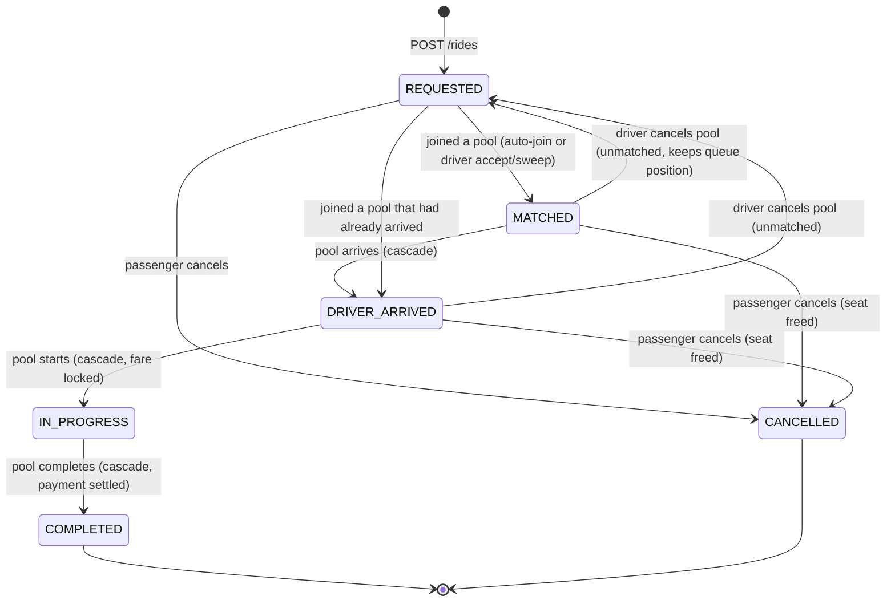
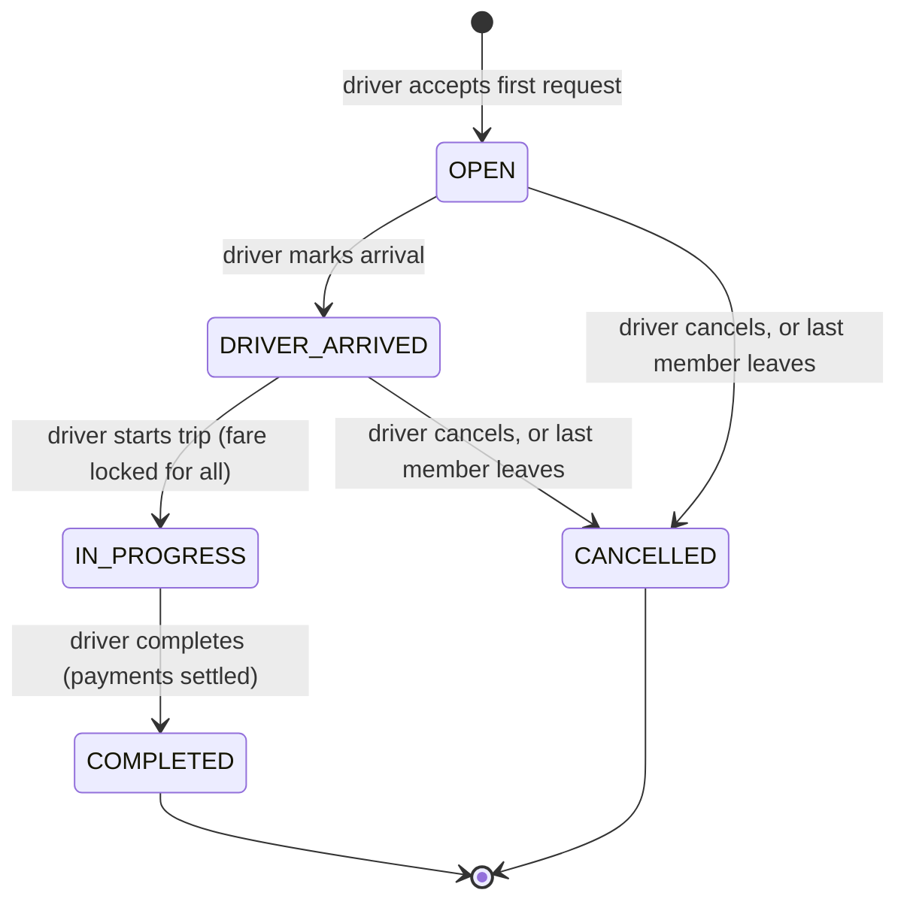

# 04 — Domain Rules

Everything the interview will probe: lifecycles, matching, fare, cancellation, payment, edge cases, and the seat race. Each rule is stated once here; code, tests, README, and video must agree with it.

## 1. Two lifecycles, not one

The PRD suggests one chain: `REQUESTED → MATCHED/ACCEPTED → DRIVER_ARRIVED → STARTED → COMPLETED (+ CANCELLED)` and invites improvement. We keep the chain for the passenger's ride request and add a parallel lifecycle for the pool, because a pool has its own identity (driver, vehicle, seats) and its own events (created, arrived, started) that happen once for several passengers.

### Ride request (what Nusrat sees)



### Pool (what Jashim sees)



### Why these changes to the suggested chain

| Change | Reason to say out loud |
|---|---|
| `STARTED` → `IN_PROGRESS` | States are conditions, events are verbs. "Started" is what happened; "in progress" is what is true now. The event `POOL_STARTED` keeps the verb |
| Separate pool states | Arrival and start happen once per vehicle, not once per passenger. Modelling them on the pool means one driver action, one transaction, N passenger rows updated consistently |
| Passengers can join at `DRIVER_ARRIVED` | Shirin grabs the last seat while Jashim is waiting at the kerb. That is the PRD story. Joining stops at `IN_PROGRESS` |
| Driver cancel reverts members to `REQUESTED` instead of `CANCELLED` | The passenger did nothing wrong and keeps their place (`created_at` unchanged) for the next driver. Counterargument: the graph is no longer acyclic. Acceptable because the back-edge is driver-triggered only and is logged as `RIDE_UNMATCHED` |
| Strict linear chain, no skipping | Simpler transition table, exhaustive negative test. A driver who forgets to press "arrived" presses it and then "start". Documented assumption |

### Transition tables (these are data in code, not `if` chains)

```ts
export const RIDE_TRANSITIONS: Record<RideStatus, RideStatus[]> = {
  REQUESTED:      ['MATCHED', 'DRIVER_ARRIVED', 'CANCELLED'],
  MATCHED:        ['DRIVER_ARRIVED', 'CANCELLED', 'REQUESTED'],
  DRIVER_ARRIVED: ['IN_PROGRESS', 'CANCELLED', 'REQUESTED'],
  IN_PROGRESS:    ['COMPLETED'],
  COMPLETED:      [],
  CANCELLED:      [],
};

export const POOL_TRANSITIONS: Record<PoolStatus, PoolStatus[]> = {
  OPEN:           ['DRIVER_ARRIVED', 'CANCELLED'],
  DRIVER_ARRIVED: ['IN_PROGRESS', 'CANCELLED'],
  IN_PROGRESS:    ['COMPLETED'],
  COMPLETED:      [],
  CANCELLED:      [],
};

// pool status → status its members must have
export const MEMBER_STATUS_FOR_POOL: Record<PoolStatus, RideStatus | null> = {
  OPEN: 'MATCHED', DRIVER_ARRIVED: 'DRIVER_ARRIVED', IN_PROGRESS: 'IN_PROGRESS',
  COMPLETED: 'COMPLETED', CANCELLED: null, // members revert to REQUESTED
};
```

Actor rules live beside them: passenger-only (`cancel` own request), driver-only (`arrive`, `start`, `complete`, `cancel` own pool), system (`MATCHED`, `REQUESTED` on revert, auto-cancel).

Every transition in the database is a **conditional update**: `UPDATE pools SET status = 'IN_PROGRESS' WHERE id = $1 AND status = 'DRIVER_ARRIVED'`. If it touches 0 rows, the service throws `409 INVALID_TRANSITION`. This gives idempotency (a double-clicked "Start" fails safely) and race safety (two conflicting transitions cannot both win) without any explicit locking. See section 7.

## 2. Matching rule

**A request may join a pool when all of the following hold:**

1. Pool status is `OPEN` or `DRIVER_ARRIVED`.
2. Request pickup zone equals pool pickup zone.
3. `pool.seats_taken + request.seats ≤ pool.capacity`.
4. The haversine distance between the request's dropoff zone and **every current member's** dropoff zone is ≤ 3 000 m.
5. Request status is `REQUESTED` and `pool_id IS NULL`.

Applied to the story:

| Pair of dropoffs | Distance | Compatible? |
|---|---|---|
| Mohakhali (Nusrat) ↔ Gulshan 1 (Rafiq) | 1 560 m | Yes |
| Mohakhali ↔ Gulshan 2 (Shirin) | 2 056 m | Yes |
| Gulshan 1 ↔ Gulshan 2 | 1 328 m | Yes |
| Mohakhali ↔ Farmgate | 2 562 m | Yes (borderline, worth showing) |
| Mohakhali ↔ Uttara | 11 131 m | No |

So Nusrat, Rafiq, and Shirin share Bullet; a fourth passenger to Uttara does not, and a fourth passenger anywhere would not fit anyway.

**Known approximation, say it in the README:** the rule ignores direction (a dropoff 2 km "behind" the pickup would pass) and road geometry. At zone granularity in Dhaka's Banani–Gulshan–Mohakhali corridor it produces sensible pools; a real product would use corridor/route polylines (see 11).

### One function, two triggers

`joinPool(tx, poolId, requestId)` is the **only** code that sets `ride_requests.pool_id` or increments `pools.seats_taken`. It runs inside the caller's transaction and returns `true` or `false`.

**Trigger A: passenger requests (`POST /rides`).**
1. Insert the request as `REQUESTED` with `distance_m` and `estimated_fare_paisa`.
2. Select candidate pools: same pickup zone, status `OPEN`/`DRIVER_ARRIVED`, `seats_taken + seats ≤ capacity`, ordered by `seats_taken DESC, created_at ASC` (fill the fullest pool first so vehicles leave sooner).
3. For each candidate, load its members' dropoff zones, check rule 4, call `joinPool`. Stop at the first `true`.
4. If none joined, the request stays `REQUESTED` and waits for a driver. Response is `201` either way with `pool: null` or a pool summary.

**Trigger B: driver accepts (`POST /driver/pools { requestId }`).**
1. Checks: driver online, has a vehicle, no active pool, request is `REQUESTED`, `request.seats ≤ capacity`.
2. Insert pool (`OPEN`, snapshots, `seats_taken 0`, `pickup_zone_id` from the request).
3. `joinPool(pool, request)`; if `false` (someone cancelled it a moment ago) the transaction rolls back → `409 REQUEST_NOT_AVAILABLE`, no orphan pool.
4. **Sweep:** select `REQUESTED` requests in the same pickup zone ordered by `created_at`, and `joinPool` each one that passes rule 4 and fits, until seats run out.
5. Commit; respond with the pool and members.

The evaluator's "apply consistently to Nusrat and Rafiq" is satisfied structurally: whether Rafiq requests before or after Jashim accepts Nusrat, the same function with the same rule decides, and the outcome is the same pool.

**"Relevant requests" for the driver** are `REQUESTED` rides in the zone the driver chose in the UI (`GET /driver/requests?pickupZoneId=`). We store no driver location. Documented assumption: a driver serves one pickup zone at a time and picks it when going online.

## 3. Fare model

All amounts are integer paisa (1 BDT = 100 paisa).

```
distance_m      = haversine(pickup zone, dropoff zone), rounded to whole metres, stored on the request
distanceCharge  = round(distance_m × PER_KM_PAISA / 1000)          PER_KM_PAISA = 1500 (15 BDT/km)
soloFare        = BASE_FARE_PAISA + distanceCharge                  BASE_FARE_PAISA = 3000 (30 BDT)
poolDiscount    = round(POOL_DISCOUNT × distanceCharge)             POOL_DISCOUNT = 0.20, applies iff pool has ≥ 2 member requests at start
perSeatFare     = soloFare − poolDiscount (or soloFare if riding alone)
passengerFare   = perSeatFare × seats
```

This is the PRD's template `baseFare + distanceCharge − poolDiscount` with named constants. Constants live in one `fare.constants.ts` file and are printed in the README.

### Worked numbers (evaluator can redo these by hand)

Haversine with Earth radius 6 371 000 m on the seeded coordinates.

| Trip | distance_m | distanceCharge | soloFare | poolDiscount | pooled perSeatFare |
|---|---|---|---|---|---|
| Nusrat: Banani → Mohakhali | 1 824 | 2 736 | **5 736** (57.36 BDT) | 547 | **5 189** (51.89 BDT) |
| Rafiq: Banani → Gulshan 1 | 1 770 | 2 655 | **5 655** (56.55 BDT) | 531 | **5 124** (51.24 BDT) |
| Shirin: Banani → Gulshan 2 | 785 | 1 178 | **4 178** (41.78 BDT) | 236 | **3 942** (39.42 BDT) |
| (contrast) Banani → Uttara | 9 547 | 14 320 | 17 320 | 2 864 | 14 456 |

Check Nusrat: `1824 × 1500 / 1000 = 2736`; `3000 + 2736 = 5736`; `0.2 × 2736 = 547.2 → 547`; `5736 − 547 = 5189`. Put exactly this line in the README and in `fare.spec.ts`.

### Rules around the fare

| Rule | Detail |
|---|---|
| Estimate at request time | `GET /fare/estimate` (before requesting) and `estimated_fare_paisa` (on the row) are the **solo** fare. The UI shows "Up to 57.36 BDT · 51.89 if pooled". |
| Lock point | `final_fare_paisa` is written for every member in the same transaction that moves the pool to `IN_PROGRESS`. From that moment membership cannot change, so the number is stable. Locking at `COMPLETED` would give the same number one step later while hiding it from the passenger during the ride. |
| Discount counts requests, not seats | One passenger booking 3 seats rides alone and pays 3 × solo. Two requests of 1 seat each both get the discount. Documented assumption. |
| Discount is flat | 20 % whether 2 or 3 members. Simpler to hand-check; a tiered discount is a one-line change and is listed under "next improvements". |
| Rounding | `Math.round` on integers only, at the two places shown. Never carry floats past the haversine step. |
| Constants are versioned by code | Changing `PER_KM_PAISA` does not rewrite history because `final_fare_paisa` is stored. |

## 4. Cancellation rules

| Who | From | Effect |
|---|---|---|
| Passenger cancels own request | `REQUESTED` | Request → `CANCELLED`, `cancelled_by = PASSENGER`. No pool involved. |
| Passenger cancels own request | `MATCHED`, `DRIVER_ARRIVED` | Transaction: conditional update on the pool (`status IN (OPEN, DRIVER_ARRIVED)`) to take the lock, `leavePool` (decrement `seats_taken`, request → `CANCELLED`, `pool_id = NULL`), event `RIDE_CANCELLED`. If `seats_taken` becomes 0 → pool → `CANCELLED` with `cancelled_by = SYSTEM`, event `POOL_CANCELLED { reason: 'EMPTY' }`. |
| Passenger cancels own request | `IN_PROGRESS`, `COMPLETED`, `CANCELLED` | `409 INVALID_TRANSITION`. You cannot leave a moving rickshaw through the API. |
| Passenger cancels someone else's request | any | `403 FORBIDDEN`. |
| Driver cancels own pool | `OPEN`, `DRIVER_ARRIVED` | Pool → `CANCELLED`; every member → `REQUESTED`, `pool_id = NULL`, event `RIDE_UNMATCHED` each; `seats_taken = 0`. Members are immediately eligible for other pools. |
| Driver cancels own pool | `IN_PROGRESS` | `409 INVALID_TRANSITION`. Complete it instead. Documented assumption. |
| Driver cancels another driver's pool | any | `403`. |
| No cancellation fee | — | Not in the PRD; listed under next improvements. |

## 5. Payment rules (simulated)

| Rule | Detail |
|---|---|
| Method chosen at request | `CASH` or `TESLAPAY`, immutable afterwards. |
| Settlement at `COMPLETED` | In the completion transaction, for each member: `CASH` → `payment_status = PAID`. `TESLAPAY` → conditional update `UPDATE users SET wallet = wallet − fare WHERE id = $u AND wallet ≥ fare`; 1 row → `PAID`, 0 rows → `PENDING` (cash due to driver). The ride completes either way; a payment problem never blocks the driver. Event `PAYMENT_SETTLED { method, status, walletBefore, walletAfter }`. |
| Wallet never negative | Both the conditional update and the DB CHECK guarantee it. |
| Top-up | Optional `POST /me/wallet/topup { amountPaisa }` for the demo. Seed balances make it unnecessary. |
| Shirin's demo | Wallet 3 000, pooled fare 3 942 → `PENDING`. One line in the video: "TeslaPay short, so Bullet's manifest shows cash due". |

## 6. Visibility rules

| Viewer | Sees | Never sees |
|---|---|---|
| Passenger, own request | Own status, own estimated/final fare, payment status, driver full name, vehicle name, pickup/dropoff zones, seats, number of co-passengers, own event timeline | Other members' names, fares, destinations |
| Passenger, someone else's request | `403` | — |
| Driver, own pool | Members' full names, seats, dropoff zones, per-member fare and payment status (they collect cash), pool events | Members' wallet balances, emails |
| Driver, open requests list | Passenger first name, pickup/dropoff, seats, requested at | Fare (irrelevant to driver before accept), emails |

## 7. Concurrency: Nusrat and Shirin, one seat left

### The scenario

Bullet has 3 seats, 2 taken. Nusrat and Shirin both submit requests within the same 50 ms. Both requests read "1 seat free". Without care both would join and `seats_taken` would be 4.

### What we do now

Every seat allocation is one **conditional UPDATE** inside a transaction:

```ts
// inside prisma.$transaction(async (tx) => { ... })
const res = await tx.pool.updateMany({
  where: {
    id: poolId,
    status: { in: ['OPEN', 'DRIVER_ARRIVED'] },
    seatsTaken: { lte: pool.capacity - request.seats },   // capacity is an immutable snapshot, safe to read first
  },
  data: { seatsTaken: { increment: request.seats } },
});
if (res.count === 0) return false;   // full or no longer joinable
await tx.rideRequest.updateMany({
  where: { id: requestId, status: 'REQUESTED', poolId: null },
  data: { poolId, status: MEMBER_STATUS_FOR_POOL[pool.status] },
});
// ... event row; if the request update returned 0 rows, throw to roll back the seat increment
```

Why it is safe, in the words to use in the interview:

1. PostgreSQL takes a row-level lock on the `pools` row when the UPDATE finds it. The second transaction's UPDATE blocks on that lock.
2. When the first commits, the second re-evaluates its `WHERE` clause against the **new** row version (this is READ COMMITTED behaviour for UPDATE). `seats_taken` is now 3, `3 ≤ 3 − 1` is false, so 0 rows are updated.
3. The loser's request remains `REQUESTED` and gets `201` with `pool: null`. Nobody saw a stale count win.
4. If the service were somehow wrong, `CHECK (seats_taken <= capacity)` rejects the write at the database. Two independent layers.

No `SELECT … FOR UPDATE`, no advisory locks, no `SERIALIZABLE`. The conditional UPDATE is the lock.

**Lock ordering.** Every path that touches a pool and its members locks the pool row first (via its conditional UPDATE), then member rows in `created_at` order. Join, leave, arrive, start, complete, driver-cancel, and sweep all follow this, so two transactions cannot wait on each other in a cycle.

**Idempotency for free.** `UPDATE … WHERE status = 'DRIVER_ARRIVED'` succeeds once. A double-click, a retried request, or two browser tabs produce one transition and one `409`. Partial unique indexes turn a double-submitted `POST /rides` into a `23505` that the exception filter maps to `409 ACTIVE_RIDE_EXISTS`.

### The test that proves it (see 08)

Seed a pool with `capacity 3, seats_taken 2`. Fire five `POST /rides` for five passengers in the same zone with compatible dropoffs using `Promise.all`. Assert: all five return `201`; exactly one has `pool_id = P`; the pool row has `seats_taken = 3`; the other four are `REQUESTED`. Run against real PostgreSQL. A mocked Prisma would pass and prove nothing.

### What changes at scale

| Scale | Change |
|---|---|
| One Postgres, many API instances | Nothing. The database serialises; the API is stateless. |
| Hot pools (thousands of joins per second on one row) | Row lock contention becomes latency. Options: optimistic `version` column with client retry; shard pools by city so contention is per-region; or make matching an asynchronous step (request goes to `REQUESTED`, a matcher assigns it) so the user-facing write never waits. |
| Multiple databases (regional) | Only then a cross-store coordinator or Redis lock. A pool never spans regions, so sharding by city avoids it. |
| Read load (status polling) | Read replicas or a cache for `GET /rides/:id`, never for the write path. Polling is replaced by SSE/WebSockets first. |

## 8. Edge-case catalogue

Every row is a decision. Implement it, test the ones marked ✔, mention the interesting ones in README "Key decisions".

| # | Situation | Rule | Test |
|---|---|---|---|
| 1 | Request created while the only candidate pool moves to `IN_PROGRESS` | Conditional UPDATE fails on status → next candidate → stays `REQUESTED` | ✔ |
| 2 | Pool at `DRIVER_ARRIVED`, Shirin requests | Joins with status `DRIVER_ARRIVED` (derived from pool), not `MATCHED` | ✔ |
| 3 | Passenger requests 2 seats, 1 free | Not joinable; stays `REQUESTED` | ✔ |
| 4 | Passenger requests more seats than any vehicle has | Stays `REQUESTED` forever; driver accept returns `409 SEATS_EXCEED_CAPACITY`. Seats capped at 6 by CHECK | ✔ |
| 5 | One of three members cancels after `DRIVER_ARRIVED` | Seat freed, pool stays `DRIVER_ARRIVED`; fare not locked yet so the remaining two still get the discount at start | ✔ |
| 6 | Last member cancels at `OPEN` or `DRIVER_ARRIVED` | Pool auto-`CANCELLED` by `SYSTEM`; driver free to accept again | ✔ |
| 7 | Driver cancels at `DRIVER_ARRIVED` | Same as at `OPEN`: members revert to `REQUESTED` | ✔ |
| 8 | Driver calls `start` from `OPEN` (skipped arrive) | `409 INVALID_TRANSITION` | ✔ |
| 9 | Driver calls `complete` twice | Second → `409` | ✔ |
| 10 | Passenger submits two requests quickly | Second → `409 ACTIVE_RIDE_EXISTS` from the partial unique index | ✔ |
| 11 | Driver double-clicks accept on two requests | Second → `409 DRIVER_HAS_ACTIVE_POOL` | ✔ |
| 12 | Driver tries to go offline with an active pool | `409 ACTIVE_POOL_EXISTS` | ✔ |
| 13 | Driver without vehicle goes online | `409 NO_VEHICLE` | |
| 14 | Offline driver accepts | `409 DRIVER_OFFLINE` | ✔ |
| 15 | Driver accepts a request a passenger cancelled a moment ago | Transaction rolls back, `409 REQUEST_NOT_AVAILABLE`, no orphan pool | ✔ |
| 16 | Two drivers in Banani accept and sweep at the same time | Each request's conditional UPDATE `WHERE status='REQUESTED' AND pool_id IS NULL` wins for exactly one pool | |
| 17 | Passenger cancels while driver starts | Both lock the pool first; one wins, the other gets `409` | |
| 18 | Pickup equals dropoff | `400 SAME_ZONE` and DB CHECK | ✔ |
| 19 | Unknown zone id | `400 VALIDATION_ERROR` | |
| 20 | Same email, different case | Lowercased in service → `409 EMAIL_TAKEN` | ✔ |
| 21 | TeslaPay wallet short at completion | `payment_status = PENDING`, ride completes | ✔ |
| 22 | Wallet exactly equal to fare | `PAID`, wallet 0 | |
| 23 | Vehicle capacity edited while pool active | Irrelevant; pool holds a snapshot. (No edit endpoint in MVP anyway) | |
| 24 | Zone deleted | Impossible: no endpoint, FK RESTRICT | |
| 25 | Passenger reads another passenger's request | `403 FORBIDDEN` (not 404: UUIDs are unguessable and the PRD test reads "can't modify another user's ride") | ✔ |
| 26 | Driver reads another driver's pool | `403` | ✔ |
| 27 | Passenger calls a driver endpoint | `403` from `RolesGuard` | ✔ |
| 28 | Expired or missing token | `401`; web clears token and redirects to login | |
| 29 | Client sends `status` or `final_fare_paisa` in a body | Stripped by `whitelist`, rejected by `forbidNonWhitelisted` → `400` | |
| 30 | Client sends timestamps | Ignored; DB `now()` only | |
| 31 | Driver completes with a member whose request is somehow not `IN_PROGRESS` | Cannot happen: cascades are transactional; CHECK constraints would reject the inconsistent row | |
| 32 | Pool completes with `seats_taken > 0` members | Normal; `seats_taken` stays as historical fact, pool is terminal | |
| 33 | Historical explainability | `GET /rides/:id` and `GET /driver/pools/:id` embed their `ride_events`; a `RIDE_UNMATCHED` event carries the old `pool_id` | |
| 34 | Cold Render instance, first request times out | Web retries `/health` up to 10 × 3 s with a banner | |
| 35 | Seed runs twice | Upserts keyed by email/zone name/fixed UUID; no duplicates | ✔ |

## 9. Assumptions to list in the README

1. A driver serves one pickup zone at a time and selects it when going online; drivers have no GPS position.
2. Destination compatibility is "within 3 km of every existing member's destination", direction-agnostic.
3. Fare constants: 30 BDT base, 15 BDT/km, 20 % pool discount on the distance charge, discount applies when at least two requests share the vehicle at start.
4. Fares lock when the trip starts; membership is frozen from that point.
5. Passengers may cancel until the trip starts; drivers may cancel until the trip starts; cancelling a pool returns its passengers to the waiting queue.
6. TeslaPay is a prepaid wallet; insufficient balance falls back to cash due, never blocks completion.
7. Zone coordinates are approximate centre points chosen for the demo.
8. One vehicle per driver, one active request per passenger, one active pool per driver.
9. No rating, no cancellation fee, no per-passenger dropoff ordering in the MVP.
