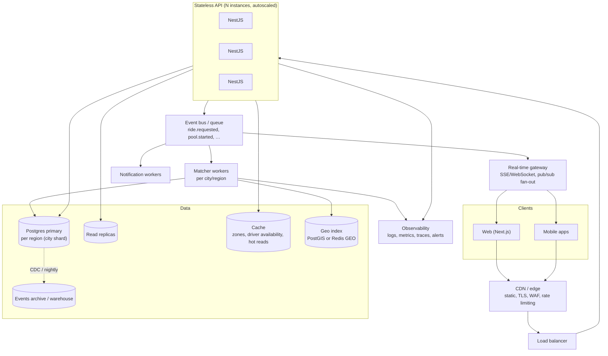

# 11 — "If Oi Tesla Goes Viral": 1M passengers, 100k drivers

The PRD asks for reasoning, not boxes. Structure: what breaks first, what we change, what we deliberately keep. Copy into `docs/scaling.md` in the repo and link from the README.

## Where the MVP breaks, in order

1. **Cold-start and single instance.** One free-tier API instance sleeps and has one CPU. Breaks at tens of concurrent users.
2. **Polling.** 1M passengers with a few percent active means ~30k open rides polling every 4 s ≈ 7.5k requests/s of near-identical reads.
3. **Candidate lookup by zone.** Twelve zones works; real coverage needs geospatial queries, and `pools (pickup_zone_id, status)` becomes a hot index.
4. **Row contention on popular pools.** Thousands of joins per second on the same `pools` row queue on its lock.
5. **Single database writes.** Every request, join, transition, and event is a write to one primary.
6. **Ride events volume.** ~6 events per ride × millions of rides per day; the table grows fast.

## Target architecture

## Topic by topic (the PRD's list)

| Topic | Change | Why now and not in the MVP |
|---|---|---|
| **Load balancing / horizontal scaling** | API is already stateless (JWT, no sessions). Run N instances behind a load balancer with health checks on `/health`; autoscale on CPU and p95 latency. Container image is unchanged. | One instance is enough for a demo; the design cost of statelessness was paid up front |
| **DB indexing / read replicas** | Keep the indexes in 03; add `(status, created_at)` for matcher scans. Route `GET` history and detail reads to replicas; writes and anything inside a transaction stay on the primary. Accept replica lag on history pages, never on active-ride status (serve that from primary or cache). | Replicas do nothing for writes; the MVP has no read load |
| **Caching** | Zones and fare constants: in-process cache with TTL. Driver availability and "pools open in zone": short-TTL cache keyed by zone, invalidated on pool events. Active-ride status: cache with pub/sub invalidation so polling (until replaced) hits cache, not Postgres. | Twelve zones and one driver do not need a cache |
| **Geospatial search** | Replace the zone table with real pickup coordinates. PostGIS `ST_DWithin` with a GiST index, or Redis GEO for driver positions updated every few seconds. Matching becomes "pools whose pickup is within r metres and whose route corridor contains my dropoff". | The PRD asked us not to fight maps in the MVP |
| **Queues / events** | Publish domain events (`ride.requested`, `pool.started`, `ride.completed`) to a bus (SQS/RabbitMQ/Kafka). Consumers: matcher, notifications, analytics, payment settlement retries. The request write path becomes "insert and publish", and matching happens asynchronously with a target of under one second. `ride_events` stays as the authoritative audit log; the bus is transport. | A queue added to one instance is theatre; here it decouples matching latency from user writes |
| **Ride matching** | Move `joinPool` into regional matcher workers consuming `ride.requested`. Each worker owns a shard (city or zone cluster), so a pool's joins are serialised by ownership, not by row locks. Improve the rule: route corridors, detour budget, driver rating, ETA. Keep the "one function decides" property. | Correctness first; the MVP rule is a placeholder that is explainable by hand |
| **Real-time communication** | Replace polling with SSE (first) or WebSockets through a gateway subscribed to the bus; fan out `ride.updated` to the passenger and driver connections. Fallback to polling when disconnected. | One sleeping instance cannot hold sockets reliably |
| **Rate limiting** | Move from in-process throttler to the edge (WAF/API gateway) with per-user and per-IP limits; tighter limits on `POST /rides` and auth. | In-process is fine for one instance |
| **Idempotency** | Add `Idempotency-Key` header on `POST /rides` and driver commands, stored with the response for 24 h, so mobile retries never double-create. The MVP already has structural idempotency via partial unique indexes and conditional updates; this adds replay of the same response. | Browser double-clicks are already covered |
| **Observability** | Structured logs (already pino) shipped to a central store; RED metrics per endpoint (rate, errors, duration); traces across API → bus → matcher with a request/ride id; alerts on p95, error rate, matcher lag, DB lock waits. Business metrics: time-to-match, pool fill rate, cancellation rate. | Render's log view suffices for a demo |
| **DB contention** | Hot pool rows: optimistic `version` column with retry, or matcher ownership (above) so only one writer touches a pool. Partition `ride_events` by month; archive to a warehouse. Connection pooling (PgBouncer / Neon pooler) in front of the primary. | Contention is only real with thousands of joins per second on one vehicle |
| **Retry / failure strategy** | Idempotent consumers with at-least-once delivery and dead-letter queues; outbox pattern so publishing an event and committing the row are atomic; circuit breakers on external payment providers; graceful degradation: if the matcher lags, requests still succeed as `REQUESTED` and the UI says "finding a Tesla". | No external systems to fail in the MVP |
| **Security** | Short-lived access tokens plus refresh tokens with revocation; httpOnly cookies once web and API share an origin behind the gateway; per-tenant/region secrets in a vault; audit access to `ride_events`; PII minimisation (phone hashing), GDPR-style export/delete for passengers; signed webhooks for payments; dependency scanning in CI. | JWT in localStorage was a documented MVP trade-off |
| **Deployment strategy** | Container images promoted through environments; blue/green or canary at the load balancer; database migrations expand-then-contract (add column, backfill, switch, drop) so old and new instances coexist; feature flags for the matching rule so a new rule can be canaried on one city. | One Render service deploys from a branch; fine for one developer |
| **Data model** | Add `pool_members` (history of membership per pool with joined_at/left_at) once analytics need it; `payments` table once refunds exist; `drivers` table once drivers have documents, ratings, and shifts. | Each was cut in the MVP with a stated switch trigger |

## What we keep

- Postgres as the system of record with the same constraints. Sharding by city keeps every pool inside one database, so the conditional UPDATE story still holds per shard.
- One matching function. Where it runs changes; what it decides does not.
- `ride_events` as the audit trail. Partition and archive it, never drop it.
- Integer paisa.

## What we would not do

- Microservices per entity on day one. Split by team boundary (matching, payments, notifications) when teams exist, not before.
- A global distributed lock. Regional ownership makes it unnecessary.
- Kubernetes before there is a platform team. Managed containers (ECS/Cloud Run) first.

## One paragraph for the interview

"The MVP is a stateless API in front of one Postgres, with the seat invariant enforced by a conditional update and a CHECK. To go viral I would keep exactly that data model, put N API instances behind a load balancer, move status updates from polling to SSE via a pub/sub gateway, push matching behind an event bus into regional workers that own their pools so contention becomes ownership instead of locks, shard Postgres by city, add PostGIS for real pickups, and wrap it in metrics, traces, idempotency keys, and expand-contract migrations. The order matters: real-time and matcher workers first, because those are what users feel; sharding last, because a single well-indexed primary carries a long way."
